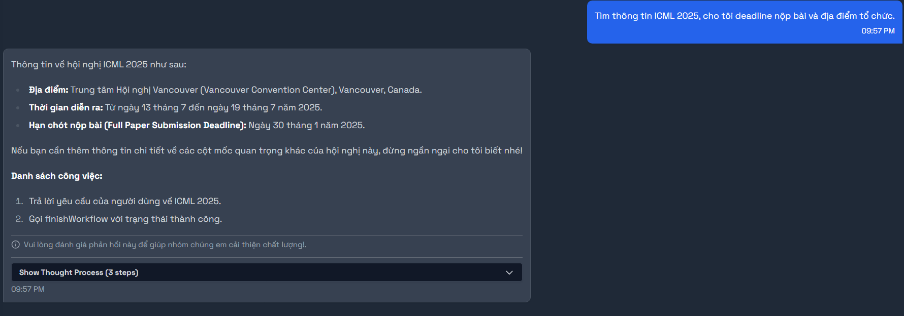
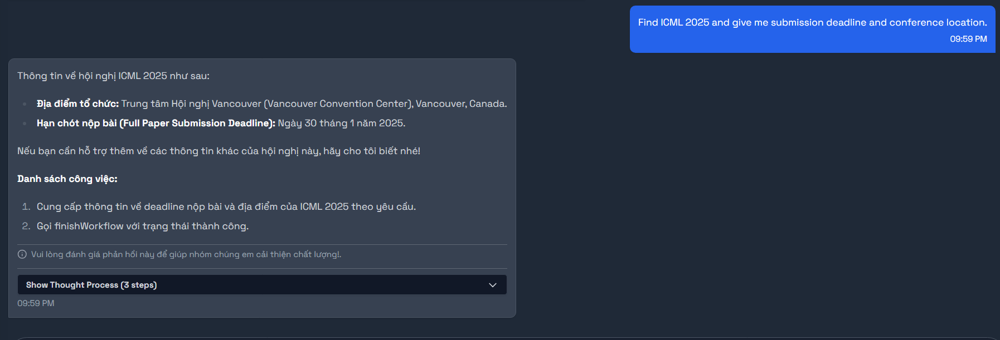
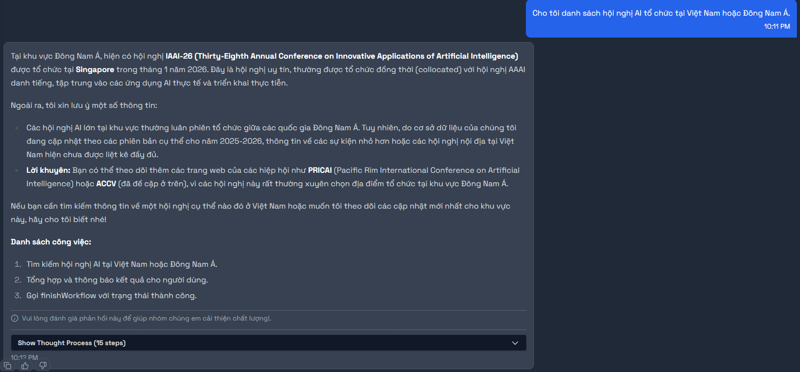
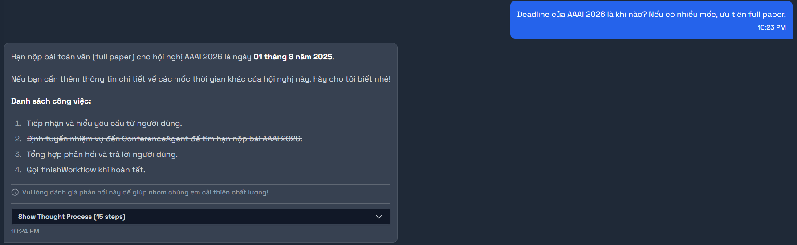
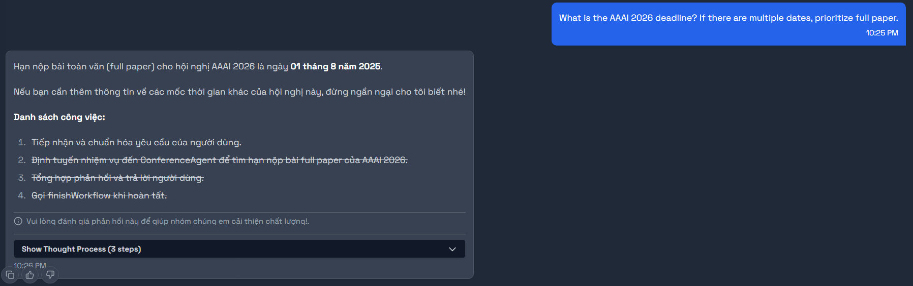
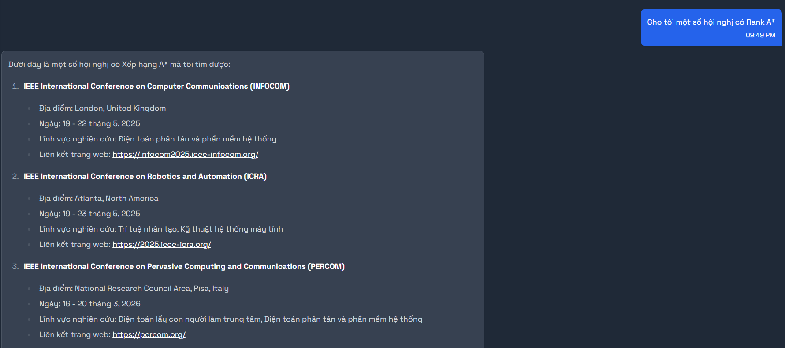
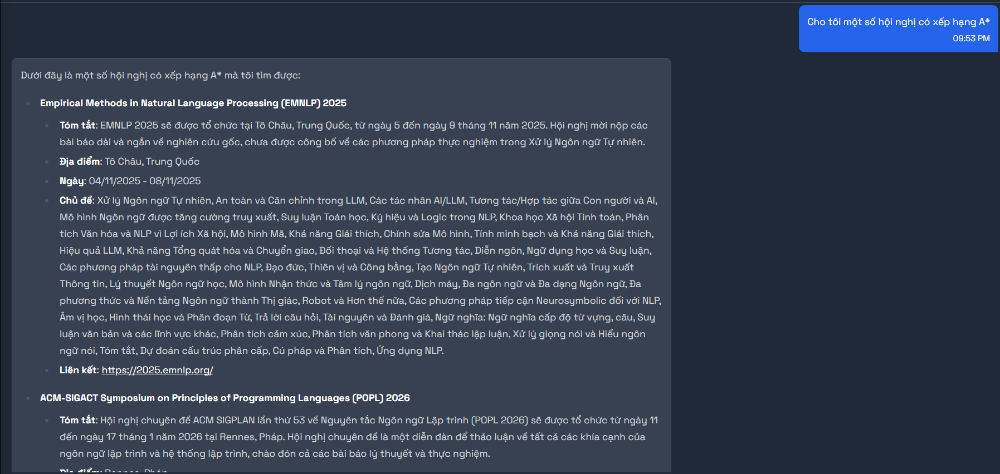

# Test khả năng truy vấn và hiểu ngôn ngữ tự nhiên của chatbot

1. Sai chính tả: Cho tôi một số thông tin về hội nghị Cconfference oon Coomputer andd Communicationss Securityy.

- Kỳ vọng: ACM Conference on Computer and Communications Security (CCS)
- Kết quả trả về:
  

2. Sử dụng tiếng Việt: Cho tôi một số thông tin về hội nghị về các hệ thống cảm biến nhúng được kết nối mạng.

- Kỳ vọng: ACM Conference on Embedded Networked Sensor Systems (SENSYS)
- Kết quả trả về:
  

3. Không khớp tên hội nghị nhưng tương đồng về nghĩa: Cho tôi một số thông tin về hội nghị về Research, Management, and Applications in Software Engineering.

- Kỳ vọng: ACIS Conference on Software Engineering Research, Management and Applications (SERA)
- Kết quả trả về:
  

4. Không khớp tên hội nghị nhưng tương đồng về nghĩa(khó hơn): Cho tôi một số thông tin về hội nghị về Studies, Administration, and Practical Uses of Software Engineering.

- Kỳ vọng: ACIS Conference on Software Engineering Research, Management and Applications (SERA)
- Kết quả trả về:
  

5. Sử dụng tiếng Việt và sai chính tả: Cho tôi một số thông tin về hội nghị về Khámm phhá Kiếnn thhhức vàa Khhai thhác Dữ liiiệu.

- Kỳ vọng: ACM International Conference on Knowledge Discovery and Data Mining (KDD)
- Kết quả trả về:
  

6. Tìm kiếm link của hội nghị: Cho tôi link chính thức của hội nghị ICML 2025.(fail)

- Kỳ vọng: Trả về URL chính thức của ICML 2025.
- Kết quả trả về:
  (Đang chờ)

7. VI: Tìm thông tin ICML 2025, cho tôi deadline nộp bài và địa điểm tổ chức.

- Kỳ vọng: Trả về deadline nộp bài và địa điểm tổ chức ICML 2025.
- Kết quả trả về:
  

8. EN: Find ICML 2025 and give me submission deadline and conference location.

- Expected: Return the submission deadline and conference location of ICML 2025.
- Actual:
  

9. VI: Hội nghị nào về NLP security trong năm 2025 ở Châu Âu? (Fail - Có thể do thiếu filter theo địa điểm)

- Kỳ vọng: Trả về danh sách hội nghị 2025 tại Châu Âu về NLP security.
- Kết quả trả về:
  (Đang chờ)

10. EN: Which conferences are about NLP security in 2025 in Europe?

- Expected: List 2025 European NLP security conferences.
- Actual:
  (TBD)

11. VI: So sánh ICLR và NeurIPS về chủ đề chính và thời hạn nộp bài gần nhất. (Fail - Bổ sung ví dụ vào prompt dạy chatbot trường hợp này)

- Kỳ vọng: So sánh chủ đề chính và deadline nộp bài gần nhất giữa ICLR và NeurIPS.
- Kết quả trả về:
  (Đang chờ)

12. EN: Compare ICLR and NeurIPS by main topics and nearest submission deadlines.

- Expected: Compare main topics and nearest submission deadlines for ICLR and NeurIPS.
- Actual:
  (TBD)

13. VI: Tìm hội nghị computer vision có rank cao và có hình thức hybrid hoặc online. (Fail - Filter có thể chứa mảng các giá trị thay vì chỉ 1 giá trị duy nhất. Bên cạnh đó, có thể bổ sung enum để chatbot dễ truyền tham số hơn)

- Kỳ vọng: Trả về hội nghị computer vision rank cao và hybrid/online.
- Kết quả trả về:
  (Đang chờ)

14. EN: Find high-rank computer vision conferences with hybrid or online format.

- Expected: Return high-rank CV conferences with hybrid or online format.
- Actual:
  (TBD)

15. VI: Cho tôi danh sách hội nghị AI tổ chức tại Việt Nam hoặc Đông Nam Á.

- Kỳ vọng: Trả về danh sách hội nghị AI tại Việt Nam/Dong Nam Á.
- Kết quả trả về:
  

16. EN: List AI conferences hosted in Vietnam or Southeast Asia.

- Expected: List AI conferences in Vietnam or Southeast Asia.
- Actual:
  (TBD)

17. VI: Deadline của AAAI 2026 là khi nào? Nếu có nhiều mốc, ưu tiên full paper.

- Kỳ vọng: Trả về deadline AAAI 2026, ưu tiên full paper.
- Kết quả trả về:
  

18. EN: What is the AAAI 2026 deadline? If there are multiple dates, prioritize full paper.

- Expected: Provide AAAI 2026 deadline, prioritize full paper.
- Actual:
  

19. VI: Tìm conference về machine learning có CFP còn mở trong 60 ngày tới. (Fail - thiếu filter theo CFP???)

- Kỳ vọng: Trả về conference ML với CFP mở trong 60 ngày.
- Kết quả trả về:
  (Đang chờ)

20. EN: Find machine learning conferences with CFP still open in the next 60 days.

- Expected: Return ML conferences with CFP open in 60 days.
- Actual:
  (TBD)

21. VI (fallback probe): Tìm hội nghị Quantum Mythical Computing Summit 2099 tại Atlantis.

- Kỳ vọng: Nêu rõ không tìm được vì là sự kiện giả tưởng/bất khả.
- Kết quả trả về:
  (Đang chờ)

22. EN (fallback probe): Find the Quantum Mythical Computing Summit 2099 in Atlantis.

- Expected: Indicate this is fictional/not found.
- Actual:
  (TBD)

23. VI (fallback probe): Hội nghị ABCXYZ-9999 năm 2045 có deadline chưa?

- Kỳ vọng: Trả về không tìm được do không tồn tại.
- Kết quả trả về:
  (Đang chờ)

24. EN (fallback probe): Does conference ABCXYZ-9999 in 2045 have a submission deadline?

- Expected: Indicate no such conference.
- Actual:
  (TBD)

# Test khả năng tương tác giữa chatbot và người dùng

- Kỳ vọng: Chatbot hỏi lại có phải bạn muốn theo dõi hội nghị "...". Hội nghị ACM Conference on Computer and Communications Security (CCS) được theo dõi thành công.
- Kết quả trả về:
  

7. Theo dõi hội nghị sử dụng tiếng Việt: Tôi muốn theo dõi hội nghị về các hệ thống cảm biến nhúng được kết nối mạng.

- Kỳ vọng: Chatbot hỏi lại có phải bạn muốn theo dõi hội nghị "...". Hội nghị ACM Conference on Embedded Networked Sensor Systems (SENSYS) được theo dõi thành công.
- Kết quả trả về:
  
  

8. Theo dõi hội nghị không khớp tên nhưng tương đồng về nghĩa: Tôi muốn theo dõi hội nghị về Research, Management, and Applications in Software Engineering.

- Kỳ vọng: Chatbot hỏi lại có phải bạn muốn theo dõi hội nghị "...". Hội nghị ACIS Conference on Software Engineering Research, Management and Applications (SERA) được theo dõi thành công.
- Kết quả trả về:
  
  
  

9. Theo dõi hội nghị không khớp tên nhưng tương đồng về nghĩa(khó hơn): Tôi muốn theo dõi hội nghị về Studies, Administration, and Practical Uses of Software Engineering. (PARTIAL SUCCESS)

- Kỳ vọng: Chatbot hỏi lại có phải bạn muốn theo dõi hội nghị "...". Hội nghị ACIS Conference on Software Engineering Research, Management and Applications (SERA) được theo dõi thành công.
- Kết quả trả về: Chatbot gợi ý các hội nghị khác ACIS
  

10. Theo dõi hội nghị sử dụng tiếng Việt và sai chính tả: Tôi muốn theo dõi hội nghị về Khámm phhá Kiếnn thhhức vàa Khhai thhác Dữ liiiệu. (PARTIAL SUCCESS)

- Kỳ vọng: Chatbot hỏi lại có phải bạn muốn theo dõi hội nghị "...". Hội nghị ACM International Conference on Knowledge Discovery and Data Mining (KDD) được theo dõi thành công.
- Kết quả trả về:
  

# Test khả năng lọc ra các hội nghị dựa vào các tiêu chí khác nhau

## Lọc theo 1 tiêu chí

1. Lọc theo Rank: Cho tôi một số hội nghị có Rank A\*.

- Kỳ vọng: Trả về danh sách các hội nghị có Rank A\*.
- Kết quả trả về:
  

2. Lọc theo Rank(dùng từ tiếng Việt của "Rank"): Cho tôi một số hội nghị có xếp hạng A\*.

- Kỳ vọng: Trả về danh sách các hội nghị có Rank A\*.
- Kết quả trả về:
  

3. Lọc theo Rank(dùng từ đồng nghĩa với "Rank" như "Level", "Class", "Tier",...): Cho tôi một số hội nghị có Level A\*.

- Kỳ vọng: Trả về danh sách các hội nghị có Rank A\*.
- Kết quả trả về:

4. Lọc theo khoảng thời gian tổ chức: Cho tôi một số hội nghị được tổ chức vào khoảng từ ngày 16/10/2024 đến ngày 19/10/2024.

- Kỳ vọng: Trả về danh sách các hội nghị được tổ chức vào khoảng thời gian này, bao gồm "AAAI Conference on Human Computation and Crowdsourcing".
- Kết quả trả về:

5. Lọc theo khoảng thời gian tổ chức(Khó): Cho tôi một số hội nghị được tổ chức vào khoảng từ ngày 17/10/2024 đến ngày 18/10/2024.

- Kỳ vọng: Trả về danh sách các hội nghị được tổ chức vào khoảng thời gian này, bao gồm "AAAI Conference on Human Computation and Crowdsourcing".
- Kết quả trả về:

## Lọc theo nhiều tiêu chí kết hợp

- Lọc theo Rank và Abstract due: Cho tôi một số hội nghị có Rank B và hạn chót nộp bản tóm tắt vào ngày 5/6/2024.
- Kỳ vọng: Trả về danh sách các hội nghị có Rank B và hạn chót nộp bản tóm tắt vào ngày 5/6/2024, bao gồm "AAAI Conference on Human Computation and Crowdsourcing".
- Kết quả trả về:
