# Test khả năng truy vấn và hiểu ngôn ngữ tự nhiên của chatbot

1. Sai chính tả: Cho tôi một số thông tin về hội nghị Cconfference oon Coomputer andd Communicationss Securityy.

- Kỳ vọng: ACM Conference on Computer and Communications Security (CCS)
- Kết quả trả về:
  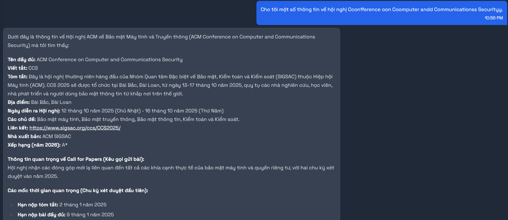

2. Sử dụng tiếng Việt: Cho tôi một số thông tin về hội nghị về các hệ thống cảm biến nhúng được kết nối mạng.

- Kỳ vọng: ACM Conference on Embedded Networked Sensor Systems (SENSYS)
- Kết quả trả về:
  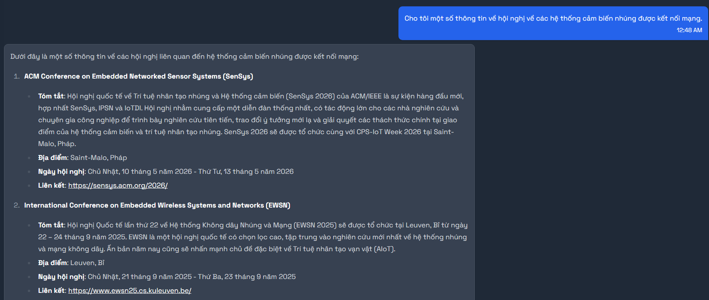

3. Không khớp tên hội nghị nhưng tương đồng về nghĩa: Cho tôi một số thông tin về hội nghị về Research, Management, and Applications in Software Engineering.

- Kỳ vọng: ACIS Conference on Software Engineering Research, Management and Applications (SERA)
- Kết quả trả về:
  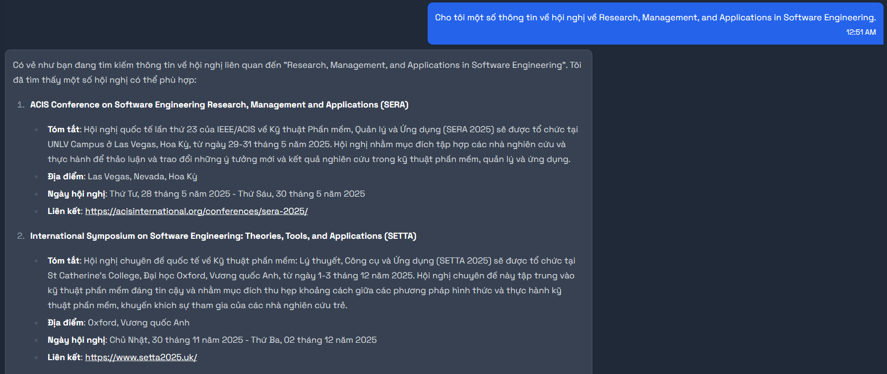

4. Không khớp tên hội nghị nhưng tương đồng về nghĩa(khó hơn): Cho tôi một số thông tin về hội nghị về Studies, Administration, and Practical Uses of Software Engineering.

- Kỳ vọng: ACIS Conference on Software Engineering Research, Management and Applications (SERA)
- Kết quả trả về:
  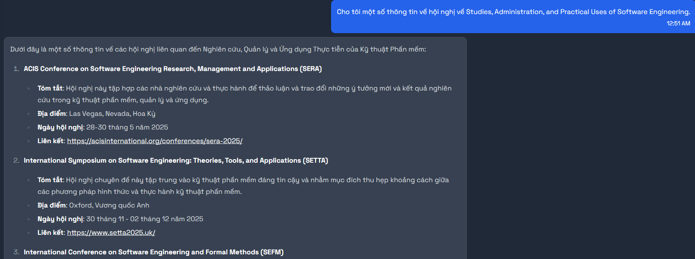

5. Sử dụng tiếng Việt và sai chính tả: Cho tôi một số thông tin về hội nghị về Khámm phhá Kiếnn thhhức vàa Khhai thhác Dữ liiiệu.

- Kỳ vọng: ACM International Conference on Knowledge Discovery and Data Mining (KDD)
- Kết quả trả về:
  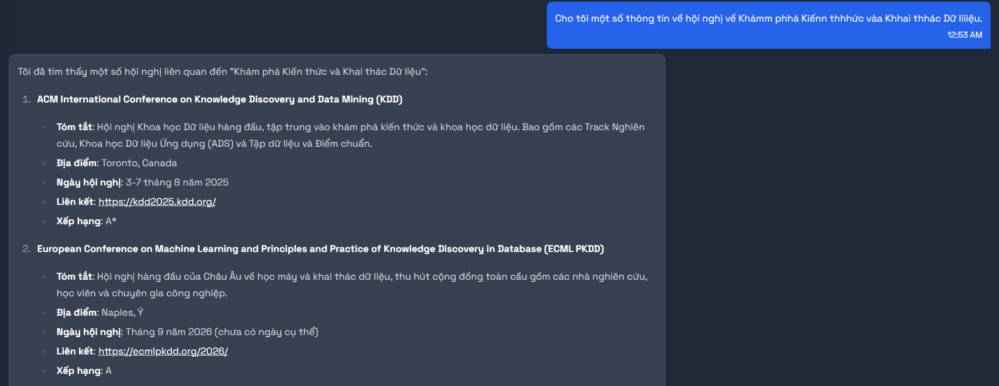

# Test khả năng tương tác giữa chatbot và người dùng

6. Theo dõi hội nghị sai chính tả: Tôi muốn theo dõi hội nghị Cconfference oon Coomputer andd Communicationss Securityy.

- Kỳ vọng: Chatbot hỏi lại có phải bạn muốn theo dõi hội nghị "...". Hội nghị ACM Conference on Computer and Communications Security (CCS) được theo dõi thành công.
- Kết quả trả về:
  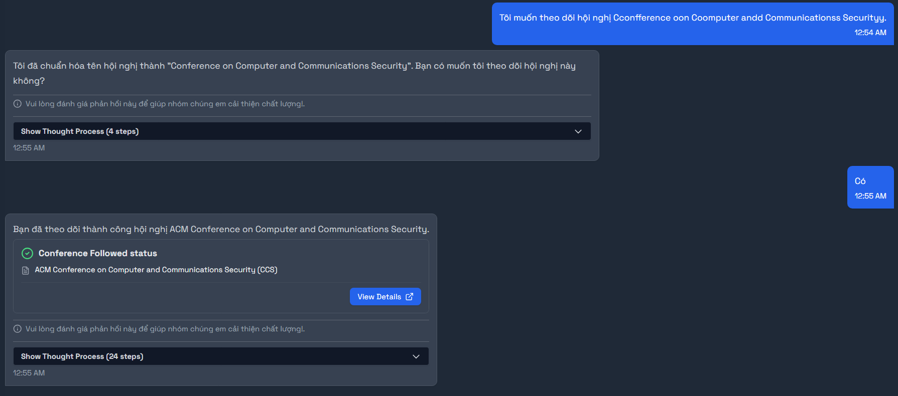

7. Theo dõi hội nghị sử dụng tiếng Việt: Tôi muốn theo dõi hội nghị về các hệ thống cảm biến nhúng được kết nối mạng.

- Kỳ vọng: Chatbot hỏi lại có phải bạn muốn theo dõi hội nghị "...". Hội nghị ACM Conference on Embedded Networked Sensor Systems (SENSYS) được theo dõi thành công.
- Kết quả trả về:
  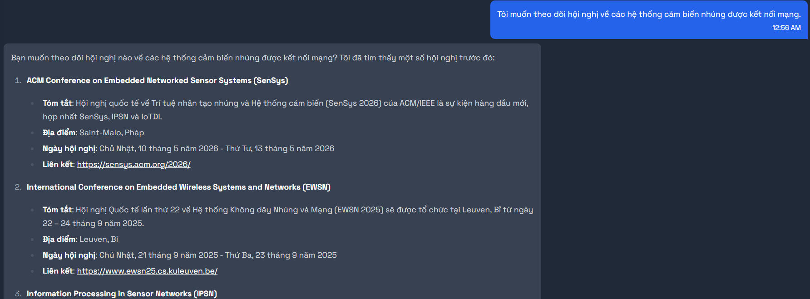
  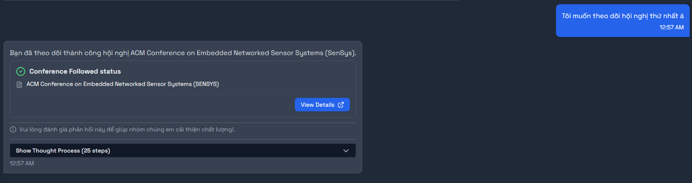

8. Theo dõi hội nghị không khớp tên nhưng tương đồng về nghĩa: Tôi muốn theo dõi hội nghị về Research, Management, and Applications in Software Engineering.

- Kỳ vọng: Chatbot hỏi lại có phải bạn muốn theo dõi hội nghị "...". Hội nghị ACIS Conference on Software Engineering Research, Management and Applications (SERA) được theo dõi thành công.
- Kết quả trả về:
  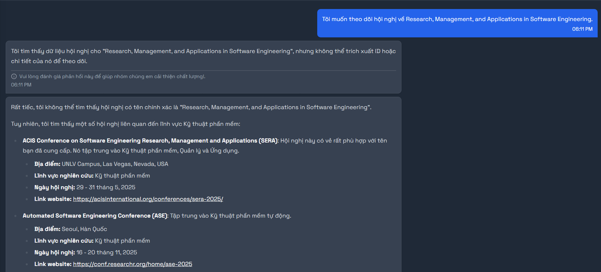
  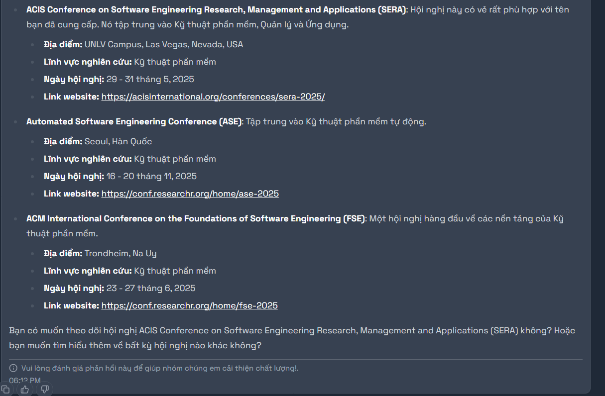
  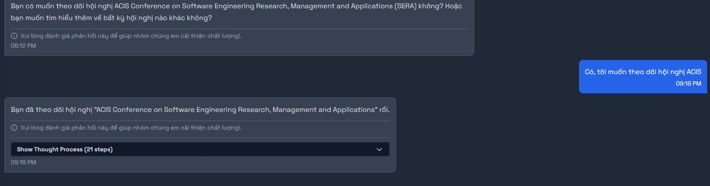

9. Theo dõi hội nghị không khớp tên nhưng tương đồng về nghĩa(khó hơn): Tôi muốn theo dõi hội nghị về Studies, Administration, and Practical Uses of Software Engineering. (PARTIAL SUCCESS)

- Kỳ vọng: Chatbot hỏi lại có phải bạn muốn theo dõi hội nghị "...". Hội nghị ACIS Conference on Software Engineering Research, Management and Applications (SERA) được theo dõi thành công.
- Kết quả trả về: Chatbot gợi ý các hội nghị khác ACIS
  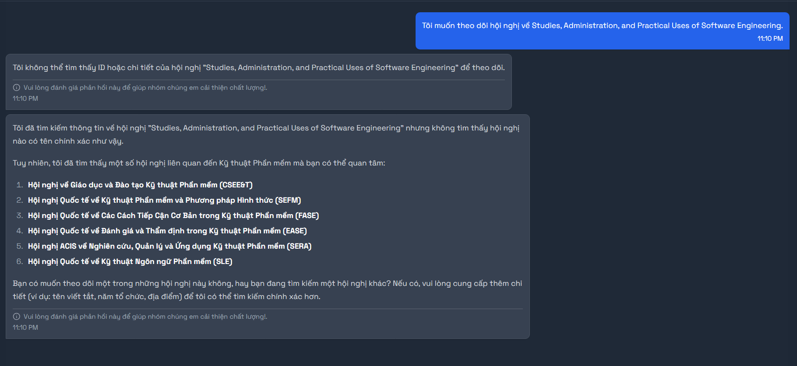

10. Theo dõi hội nghị sử dụng tiếng Việt và sai chính tả: Tôi muốn theo dõi hội nghị về Khámm phhá Kiếnn thhhức vàa Khhai thhác Dữ liiiệu. (PARTIAL SUCCESS)

- Kỳ vọng: Chatbot hỏi lại có phải bạn muốn theo dõi hội nghị "...". Hội nghị ACM International Conference on Knowledge Discovery and Data Mining (KDD) được theo dõi thành công.
- Kết quả trả về:
  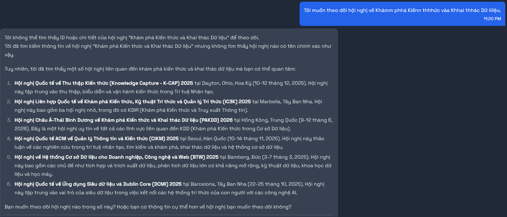

# Test khả năng lọc ra các hội nghị dựa vào các tiêu chí khác nhau

## Lọc theo 1 tiêu chí

1. Lọc theo Rank: Cho tôi một số hội nghị có Rank A\*.

- Kỳ vọng: Trả về danh sách các hội nghị có Rank A\*.
- Kết quả trả về:

2. Lọc theo Rank(dùng từ tiếng Việt của "Rank"): Cho tôi một số hội nghị có xếp hạng A\*.

- Kỳ vọng: Trả về danh sách các hội nghị có Rank A\*.
- Kết quả trả về:

3. Lọc theo Rank(dùng từ đồng nghĩa với "Rank" như "Level", "Class", "Tier",...): Cho tôi một số hội nghị có Level A\*.

- Kỳ vọng: Trả về danh sách các hội nghị có Rank A\*.
- Kết quả trả về:

4. Lọc theo khoảng thời gian tổ chức: Cho tôi một số hội nghị được tổ chức vào khoảng từ ngày 16/10/2024 đến ngày 19/10/2024.

- Kỳ vọng: Trả về danh sách các hội nghị được tổ chức vào khoảng thời gian này, bao gồm "AAAI Conference on Human Computation and Crowdsourcing".
- Kết quả trả về:

5. Lọc theo khoảng thời gian tổ chức(Khó): Cho tôi một số hội nghị được tổ chức vào khoảng từ ngày 17/10/2024 đến ngày 18/10/2024.

- Kỳ vọng: Trả về danh sách các hội nghị được tổ chức vào khoảng thời gian này, bao gồm "AAAI Conference on Human Computation and Crowdsourcing".
- Kết quả trả về:

## Lọc theo nhiều tiêu chí kết hợp

- Lọc theo Rank và Abstract due: Cho tôi một số hội nghị có Rank B và hạn chót nộp bản tóm tắt vào ngày 5/6/2024.
- Kỳ vọng: Trả về danh sách các hội nghị có Rank B và hạn chót nộp bản tóm tắt vào ngày 5/6/2024, bao gồm "AAAI Conference on Human Computation and Crowdsourcing".
- Kết quả trả về:
