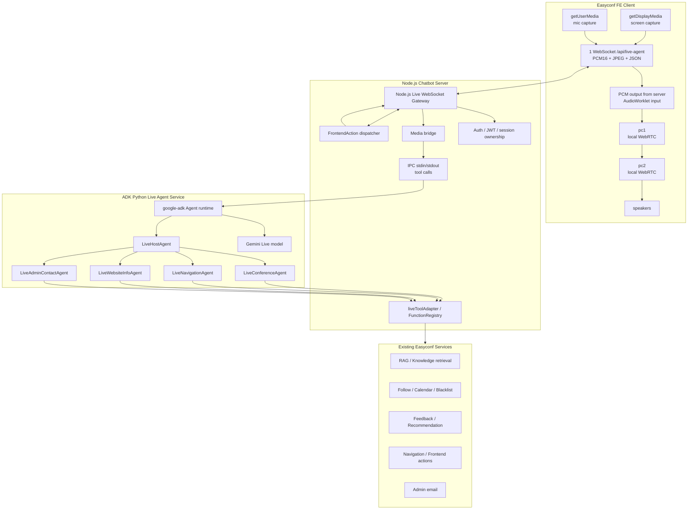

# Step-by-step plan: Live Multi-Agent Easyconf Chatbot bằng Google ADK Python

## 0. Mục tiêu và phạm vi

Tài liệu này là kế hoạch triển khai hệ thống **Live Multi-Agent** cho Easyconf Chatbot dựa trên **Google ADK Python** (`google-adk`) và model **`gemini-live-2.5-flash-native-audio`**.

Hệ thống mới hỗ trợ:

- Voice chat realtime: người dùng nói bằng microphone, agent trả lời bằng giọng nói. ✓
- Share màn hình: người dùng chia sẻ màn hình/trang Easyconf để agent hiểu ngữ cảnh UI. ✓
- Multi-agent orchestration giống hệ thống hiện tại: ✓
  - `HostAgent` ✓
  - `ConferenceAgent` ✓
  - `NavigationAgent` ✓
  - `WebsiteInfoAgent` ✓
  - `AdminContactAgent` ✓
- Tool set giống hệ thống hiện tại, tham khảo: ✓
  - `Code/Easyconf-Chatbot-Server/src/chatbot/language/functions/english.ts`
  - `Code/Easyconf-Chatbot-Server/src/chatbot/language/instructions/english.ts`
- Luồng ghi âm/share màn hình tham khảo `REPORT.md` trong cùng thư mục. ✓

Nguyên tắc quan trọng:

- Live chatbot là runtime mới, chạy song song với text chatbot hiện tại. ✓
- Không thay thế ngay code Node.js text chatbot hiện có. ✓
- Không để FE giữ Gemini API key. ✓
- Không lưu raw audio/screen frame mặc định. ✓
- Tool nghiệp vụ vẫn đi qua Chatbot Server/Backend hiện tại để giữ auth, logging, rule và side-effect guard. ✓

---

## 1. Kiến trúc tổng thể đề xuất



### Vì sao phải dùng Python?

Google ADK **chỉ có Python SDK hỗ trợ Live Agent** (`gemini-live-2.5-flash-native-audio`). TypeScript SDK (`@google/genai`) có LiveClient nhưng là API thấp, không có `Agent` abstraction với multi-agent orchestration. Bắt buộc phải thêm một service Python:

- Node.js vẫn giữ gateway, auth, tool handler hiện tại. ✓
- Python service đảm nhận ADK multi-agent orchestration + Gemini Live. ✓
- Có thể rollback/tắt feature live qua env mà không ảnh hưởng regular chat. ✓

---

## 2. Mapping agent hiện tại sang ADK Python

| Agent hiện tại | ADK Python agent mới | Vai trò |
|---|---|---|
| `HostAgent` | `LiveHostAgent` | Điều phối intent, dùng screen/audio context, gọi sub-agent, tổng hợp câu trả lời ngắn để nói ✓ |
| `ConferenceAgent` | `LiveConferenceAgent` | Search/detail/list conference, follow, calendar, blacklist, feedback, recommendation ✓ |
| `NavigationAgent` | `LiveNavigationAgent` | Điều hướng trang Easyconf, mở external URL, mở Google Map ✓ |
| `WebsiteInfoAgent` | `LiveWebsiteInfoAgent` | Trả lời hướng dẫn sử dụng GCJH/Easyconf website ✓ |
| `AdminContactAgent` | `LiveAdminContactAgent` | Soạn/gửi email admin sau khi xác nhận rõ ✓ |

### Orchestration mode

ADK Python 2.0 hỗ trợ routing tự động qua tham số `agents`. Khi truyền sub-agent vào `LiveHostAgent`, runtime tự quyết định khi nào transfer dựa trên instruction và context — hoàn toàn dynamic, không cần tool `route_to_agent` tự viết: ✓

```python
root_agent = Agent(
    name="LiveHostAgent",
    model="gemini-live-2.5-flash-native-audio",
    instruction=HOST_AGENT_INSTRUCTION,
    agents=[conference_agent, navigation_agent, website_info_agent, admin_contact_agent],
)
```
✓ (`agents/root.py`)

Không dùng `Workflow` graph — mọi routing đều do LLM tự điều phối linh hoạt, giống cách HostAgent hiện tại phân tích intent rồi gọi sub-agent. Điều này đảm bảo: ✓
- Agent có thể tự quyết định dựa trên ngữ cảnh giọng nói + màn hình. ✓
- Dễ mở rộng thêm sub-agent mới mà không sửa luồng cứng. ✓
- Giữ nguyên triết lý "agent tự điều phối" của hệ thống hiện tại. ✓

---

## 3. Tool catalog cần giữ nguyên

### 3.1 Host tools

Routing sub-agent do ADK runtime xử lý tự động qua tham số `agents` — không cần tool route riêng. ✓

| Tool | Mục đích |
|---|---|
| `saveResultSet` / `save_result_set` | Lưu danh sách hội nghị do user cung cấp để reference theo ordinal ✓ |

### 3.2 Conference tools

| Tool | Mục đích |
|---|---|
| `retrieveKnowledge` | RAG/search/detail/list conference, hỗ trợ filter/listMode/useRecommendationFilter ✓ |
| `manageFollow` | Follow/unfollow/list followed conferences ✓ |
| `manageCalendar` | Add/remove/list calendar conferences ✓ |
| `manageBlacklist` | Add/remove/list blacklist conferences ✓ |
| `countConferenceFollowed` | Đếm followers của conference ✓ |
| `rateConference` | Rating + feedback ✓ |
| `getConferenceFeedback` | Lấy feedback/review ✓ |
| `showMoreConferenceFeedback` | Lấy thêm feedback ✓ |
| `getRecommendations` | Recommendation generic ✓ |
| `getSimilarConferences` | Tìm conference tương tự ✓ |
| `showMoreRecommendations` | Pagination/continuation cho list/recommendation ✓ |

### 3.3 Navigation/Admin/Website tools

| Agent | Tool |
|---|---|
| `LiveNavigationAgent` | `navigation`, `openGoogleMap` ✓ |
| `LiveAdminContactAgent` | `sendEmailToAdmin` ✓ |
| `LiveWebsiteInfoAgent` | `getWebsiteInfo` ✓ |

### 3.4 Tool execution strategy

Không rewrite nghiệp vụ trong Python ngay. Python ADK tool gọi về Node.js Chatbot Server qua IPC (stdin/stdout JSON-line protocol). Node spawns Python ADK service làm child process:

```text
ADK Python tool call
  -> gửi JSON line hoặc binary header+payload qua stdout (Python -> Node)
  -> Node existing FunctionRegistry / handler
  -> modelResponseContent + frontendActions
  -> Node dispatch frontendActions tới FE qua WebSocket (song song)
  -> Node gửi JSON result hoặc binary output qua stdin (Node -> Python)
  -> Python tool result / media output trả về ADK
  -> Gemini Live continues response
```

Lý do:

- Handler hiện tại đã có auth, logging, result set, frontend action, API call tới BE. ✓
- Tránh duplicate logic giữa Node và Python. ✓
- IPC nhanh hơn HTTP vì không cần TCP overhead, cùng process. ✓
- Dễ rollback vì text chatbot không bị ảnh hưởng. ✓

---

## 4. Thiết kế media live + AEC

### Vấn đề: Loop vô tận ✓

Gemini Live nói → loa phát → mic thu lại giọng nói đó → gửi lên Gemini → Gemini trả lời tiếp → loop. Cần AEC (Acoustic Echo Cancellation) để triệt echo.

### Giải pháp: pc1-pc2 WebRTC nội bộ tại FE ✓

Không cần server-side WebRTC. FE tạo 2 RTCPeerConnection local, audio Gemini đi qua pc1→pc2 trước khi ra loa, trình duyệt thấy luồng audio đó là echo reference → AEC built-in hoạt động: ✓ (`pc1-pc2-aec.ts`)

```text
getUserMedia (mic)
  -> PCM -> FE WebSocket -> Node -> IPC -> Python -> Gemini Live

Gemini Live audio output
  -> IPC -> Node -> WebSocket -> FE PCM
  -> AudioWorklet -> MediaStreamTrack
  -> pc1.addTrack() -> pc2 (local WebRTC)
  -> pc2.ontrack -> <audio> -> speakers (AEC kích hoạt)

Browser sees: mic input + remote audio from pc1
Built-in AEC subtracts pc1 audio from mic signal -> NO LOOP
```

### 4.1 Microphone input ✓

1. `navigator.mediaDevices.getUserMedia()` với: ✓
   - `echoCancellation: true` ✓
   - `noiseSuppression: true` ✓
   - `autoGainControl: true` ✓
   - `channelCount: 1` ✓
2. Web Audio API lấy PCM float. ✓
3. Convert `Float32Array` sang PCM 16-bit signed. ✓
4. Gửi binary frame `0x01 + PCM16 bytes` lên Node. ✓
5. Node forward binary qua IPC stdin/stdout sang Python service. ✓
6. Python gửi vào Gemini Live với MIME `audio/pcm;rate=16000`. ✓

### 4.2 Screen sharing input ✓

1. `navigator.mediaDevices.getDisplayMedia()`. ✓
2. Capture frame định kỳ, MVP 1 FPS hoặc mỗi 1.5 giây. ✓
3. Resize canvas ~640x360 hoặc 768x432. ✓
4. Encode JPEG quality 0.65-0.75. ✓
5. Gửi binary `0x02 + JPEG bytes` lên Node. ✓
6. Node forward sang Python. ✓
7. Python gửi vào Gemini Live với MIME `image/jpeg`. ✓

### 4.3 pc1-pc2 AEC flow (chi tiết) ✓ (`pc1-pc2-aec.ts`)

```javascript
// 1. Tạo pc1 và pc2
const pc1 = new RTCPeerConnection();
const pc2 = new RTCPeerConnection();

// 2. pc2.ontrack: nhận remote audio từ pc1 -> phát loa
pc2.ontrack = (event) => {
  const audio = new Audio();
  audio.srcObject = event.streams[0];
  audio.play();  // AEC tự động reference luồng này
};

// 3. pc1.onicecandidate -> pc2.addIceCandidate (và ngược lại)
pc1.onicecandidate = (e) => e.candidate && pc2.addIceCandidate(e.candidate);
pc2.onicecandidate = (e) => e.candidate && pc1.addIceCandidate(e.candidate);

// 4. Khi nhận Gemini audio từ IPC -> convert thành MediaStreamTrack
// Dùng AudioWorklet để biến PCM buffer thành track
const ctx = new AudioContext();
const workletNode = new AudioWorkletNode(ctx, "pcm-player");
const dest = ctx.createMediaStreamDestination();
workletNode.connect(dest);

// 5. add track vào pc1 -> gửi sang pc2
dest.stream.getTracks().forEach((t) => pc1.addTrack(t));

// 6. Signaling local
const offer = await pc1.createOffer({ offerToReceiveAudio: false });
await pc1.setLocalDescription(offer);
await pc2.setRemoteDescription(offer);
const answer = await pc2.createAnswer();
await pc2.setLocalDescription(answer);
await pc1.setRemoteDescription(answer);
```

### 4.4 Audio output path ✓

```text
Gemini Live audio chunk
  -> ADK Python service
  -> Node Gateway
  -> IPC binary payload -> FE WebSocket binary frame 0x01 + PCM16
  -> AudioWorklet decode PCM16 -> Float32
  -> pc1 -> pc2 -> <audio> playback (AEC enabled)
```

---

## 5. Cấu trúc thư mục đề xuất

### 5.1 Python ADK service

Đề xuất tạo trong repo Chatbot Server hoặc monorepo:

```text
Code/Easyconf-Chatbot-Server/adk_live_service/
  pyproject.toml
  README.md
  .env.example
  easyconf_live/
    __init__.py
    main.py
    config.py
    app.py
    sessions/
      live_session_manager.py
      live_transport.py
    agents/
      __init__.py
      root_agent.py
      host_agent.py
      conference_agent.py
      navigation_agent.py
      website_info_agent.py
      admin_contact_agent.py
      instructions.py
    tools/
      __init__.py
      tool_proxy.py
      tool_schemas.py
      conference_tools.py
      navigation_tools.py
      website_tools.py
      admin_tools.py
    models/
      live_messages.py
      tool_result.py
    tests/
      test_tool_proxy.py
      test_agent_routing.py
```

### 5.2 Node.js Chatbot Server additions

```text
src/live/
  live.routes.ts
  liveSessionManager.ts
  liveAdkBridge.ts
  liveIpcProtocol.ts
  liveMessage.types.ts
  liveAuth.ts
  tools/
    liveToolAdapter.ts
```

`liveAdkBridge.ts` chịu trách nhiệm: ✓

- Spawn Python ADK service làm child process. ✓
- Giao tiếp IPC qua stdin/stdout với JSON-line + binary envelope protocol (`liveIpcProtocol.ts`). ✓
- Forward audio/video/text. ✓
- Nhận audio/transcript/tool/status/frontend-action. ✓
- Cleanup khi disconnect/kill Python process. ✓

---

## 6. Step-by-step implementation plan

### Phase 0 — Chốt MVP và feature flag ✓

1. Thêm feature flag: ✓
   - `LIVE_AGENT_ENABLED=false` ✓
   - `LIVE_AGENT_PROVIDER=adk-python` ❌ (không có trong code thực tế)
   - `LIVE_AGENT_MODEL=gemini-live-2.5-flash-native-audio` ✓
2. Chốt MVP gồm: ✓
   - Voice hỏi đáp realtime. ✓
   - Share màn hình. ✓
   - Tools: `retrieveKnowledge`, `navigation`, `openGoogleMap`, `getWebsiteInfo`. ✓
3. Tạm khóa hoặc yêu cầu confirmation cho side-effect tools: ✓
   - `manageFollow` ✓
   - `manageCalendar` ✓
   - `manageBlacklist` ✓
   - `rateConference` ✓
   - `sendEmailToAdmin` ✓

Definition of Done:

- Có env/config rõ ràng để bật/tắt live ADK Python. ✓
- Không ảnh hưởng regular text chatbot. ✓

---

### Phase 1 — Bootstrap Google ADK Python service ✓

1. Tạo Python project `adk_live_service`. ✓
2. Cài dependency: ✓

```bash
pip install google-adk
```

3. Yêu cầu Python `3.11+` theo ADK README. ✓
4. Tạo `config.py` đọc env: ✓
   - `GOOGLE_API_KEY` hoặc Vertex AI config nếu dùng Vertex. ❌ (dùng `GEMINI_API_KEY` thay vì `GOOGLE_API_KEY`)
   - `LIVE_AGENT_MODEL=gemini-live-2.5-flash-native-audio`. ✓
    - `IPC_MODE=stdio` — Python chạy dưới dạng child process của Node, giao tiếp qua stdin/stdout. ✓ (không cần env var riêng; stdio là mặc định)
   - timeout/session limits. ✓
5. Tạo root agent tối thiểu: ✓

```python
from google.adk import Agent

root_agent = Agent(
    name="easyconf_live_host_agent",
    model="gemini-live-2.5-flash-native-audio",
    instruction="You are Easyconf LiveHostAgent...",
)
```

6. Chạy smoke test bằng ADK CLI nếu phù hợp: ❌ (chưa có smoke test script)

```bash
adk run adk_live_service/easyconf_live/agents
```

Definition of Done:

- Python service import được `google.adk`. ✓
- Root agent khởi tạo được với model live. ✓
- Có health endpoint hoặc CLI smoke test. ❌ (chưa có)

---

### Phase 2 — Thiết kế ADK agents và instructions ✓

1. Tạo `instructions.py` dựa trên `english.ts`, nhưng rút gọn cho voice: → dùng `prompts.py` (khác tên file)
   - Câu trả lời ngắn, tự nhiên. ✓
   - Không đọc list quá dài bằng giọng nói. ✓
   - Với list dài: nói tóm tắt + gửi `displayList` action. ✓
   - Nếu screen context mơ hồ: hỏi lại. ✓
   - Với action ghi dữ liệu: xác nhận rõ trước. ✓
2. Tạo các agent: ✓

```python
from google.adk import Agent

conference_agent = Agent(
    name="LiveConferenceAgent",
    model="gemini-live-2.5-flash-native-audio",
    instruction=CONFERENCE_AGENT_INSTRUCTION,
    tools=[...],
)

navigation_agent = Agent(...)
website_info_agent = Agent(...)
admin_contact_agent = Agent(...)

root_agent = Agent(
    name="LiveHostAgent",
    model="gemini-live-2.5-flash-native-audio",
    instruction=HOST_AGENT_INSTRUCTION,
    agents=[conference_agent, navigation_agent, website_info_agent, admin_contact_agent],
)
```

3. Mapping rule từ HostAgent hiện tại: ✓
   - Conference intent → `LiveConferenceAgent`. ✓
   - Navigation/map intent → `LiveNavigationAgent`. ✓
   - Website usage intent → `LiveWebsiteInfoAgent`. ✓
   - Admin/report intent → `LiveAdminContactAgent`. ✓
   - File/image/screen question → Host xử lý trực tiếp nếu đủ context. ✓
4. Giữ nguyên rule "không route nếu có thể trả lời từ context gần nhất". ✓
5. Giữ rule ordinal/result set: ✓
   - User gửi list nhiều conference → gọi `save_result_set`. ✓
   - Model-generated list từ `retrieveKnowledge` nên auto-save ở Node handler nếu hiện tại đã làm. ✓

Definition of Done:

- Có instruction riêng cho từng live agent. ✓
- Có root agent và sub-agent definitions rõ ràng. ✓
- Agent catalog giống hệ thống hiện tại. ✓

---

### Phase 3 — Tool proxy từ Python sang Node (qua IPC) ✓

Node spawns Python ADK service làm child process, giao tiếp qua stdin/stdout với JSON-line + binary envelope protocol (JSON line hoàn chỉnh kết thúc bằng `\0` để tránh collision với `\n` trong nội dung JSON, binary payload đi sau header JSON `binary: true`). ✓

#### 3.1 Protocol messages ✓

**Tool call request** (Python → Node, viết ra stdout): ✓

```json
{"type":"tool_call","id":"req-001","tool":"retrieveKnowledge","sessionId":"live-session-id","userId":"user-id","locale":"en","args":{"query":"AI conferences 2026"}}
```

**Tool call response** (Node → Python, ghi vào stdin — `frontendActions` đã được Node dispatch trực tiếp xuống FE): ✓

```json
{"type":"tool_result","id":"req-001","ok":true,"modelResponseContent":"Here are the results..."}
```

#### 3.2 Node side — `liveAdkBridge.ts` ✓

Khi Node nhận IPC message `tool_call` từ stdout của Python process: ✓

1. Parse JSON message. ✓
2. Gọi `liveToolAdapter.executeTool()` hoặc `functionRegistry` hiện tại → nhận `modelResponseContent` + `frontendActions`. ✓
3. **Dispatch `frontendActions` tới FE qua WebSocket** (Node giữ kết nối WebSocket với FE). ✓
4. Ghi JSON response (chỉ `modelResponseContent`, không gửi lại `frontendActions`) vào stdin của Python process. ✓

#### 3.3 Python side — `tools/proxy.py` (plan gọi là `tool_proxy.py`)

```python
import sys, json

def handle_tool_call(tool_name: str, args: dict, session_id: str, user_id: str, locale: str) -> dict:
    """Gửi tool call request sang Node qua stdout, đọc response từ stdin."""
    req = {
        "type": "tool_call",
        "id": f"req-{session_id}-{tool_name}",
        "tool": tool_name,
        "sessionId": session_id,
        "userId": user_id,
        "locale": locale,
        "args": args,
    }
    sys.stdout.buffer.write(json.dumps(req).encode("utf-8") + b"\0")
    sys.stdout.buffer.flush()
    # Chờ response qua stdin (xem transport Phase 4)
```

#### 3.4 ADK tool wrapper pattern ✓

Mỗi ADK tool wrapper chỉ làm 3 việc: ✓
- Validate args cơ bản. ✓
- Gọi `handle_tool_call()`. ✓
- Return `modelResponseContent` cho agent. ✓

**`frontendActions` không qua Python** — Node tự dispatch trực tiếp xuống FE. ✓ Đây là điểm khác biệt quan trọng so với kiến trúc HTTP cũ.

Definition of Done:

- Node spawns được Python ADK process và giao tiếp IPC. ✓
- Python gọi được Node tool `getWebsiteInfo` qua IPC. ✓
- Python gọi được Node tool `retrieveKnowledge` qua IPC. ✓
- FrontendAction từ Node được gửi ngược về FE qua live gateway. ✓

---

### Phase 4 — Live transport Node ↔ Python ✓

Node cần 1 kênh giao tiếp với Python: **IPC stdin/stdout**. Kênh này mang cả JSON line (tool call, control, transcript, status) lẫn binary payload với header JSON (audio, screen frame, audio output). ✓

#### 4.1 Protocol IPC đơn kênh ✓

```text
Python stdout                         Node stdin/stdout parser
  │  {"type":"tool_call",...}         │ executeTool()
  ├────────────────────────────────────►│
  │  {"binary":true,"kind":"audio_output",...}+payload
  ├────────────────────────────────────►│ forward to FE
  │  {"type":"tool_result",...}       │
  │◄────────────────────────────────────┤
  │  {"binary":true,"kind":"audio_input",...}+payload
  │◄────────────────────────────────────┤ forward to Gemini Live
```

#### 4.2 Protocol summary ✓

| Kênh | Message | Hướng | Payload |
|---|---|---|---|
| stdout (Python→Node) | `tool_call` | Python → Node | JSON: tool name + args |
| stdin (Node→Python) | `tool_result` | Node → Python | JSON: modelResponseContent |
| stdout (Python→Node) | `binary: audio_output` | Python → Node | header JSON + PCM output bytes |
| stdin (Node→Python) | `binary: audio_input` | Node → Python | header JSON + PCM16 bytes |
| stdin (Node→Python) | `binary: screen_frame` | Node → Python | header JSON + JPEG bytes |
| stdin/stdout | `transcript` / `status` / `session.*` / `interrupt` | hai chiều | JSON line |

#### 4.3 Chọn cho MVP ✓

Chọn **Option A** (Python giữ Gemini Live session). Node spawns Python, toàn bộ giao tiếp với Python đi qua IPC stdin/stdout. ✓

Definition of Done:

- Node nhận audio từ FE và forward tới Python (qua IPC media pipe). ✓
- Python trả audio output về Node. ✓
- Node forward audio output về FE. ✓

---

### Phase 5 — Gemini Live native audio config ✓

1. Cấu hình model mặc định: ✓

```text
gemini-live-2.5-flash-native-audio
```

2. Response modality: ✓
   - Audio là output chính. ✓
   - Transcript text gửi về FE để hiển thị/debug. ✓
3. Input modalities: ✓
   - Audio realtime từ mic. ✓
   - Image/video frame từ screen sharing. ✓
   - Optional text fallback. ✓
4. Audio input: ✓
   - PCM 16-bit, 16kHz, mono. ✓
5. Audio output: ✓
   - FE player phải tương thích output PCM của Gemini Live, mặc định plan giữ 24kHz theo `REPORT.md` nếu SDK trả rate này. ✓
6. Khi reconnect: ✓
   - Tạo session mới. ✓
   - Không reuse raw audio history. ✓
   - Có thể seed bằng transcript/action summary ngắn nếu cần. ✓

Definition of Done:

- User nói một câu, model trả audio native. ✓
- FE phát audio không rè/click nghiêm trọng. ✓
- Transcript hiển thị đúng nguồn `user`/`model`. ✓

---

### Phase 6 — FE live client refactor ✓

1. FE không gọi Gemini trực tiếp nữa. ✓
2. `useLiveApi`/live hooks kết nối WebSocket tới Node: ✓

```text
ws(s)://<chatbot-server>/api/live-agent
```

3. Auth flow: ✓
   - Client mở WebSocket. ✓
   - Server gửi `session.auth_required`. ✓
   - Client gửi `{ type: "auth", payload: { token, locale } }`. ✓
   - Server verify rồi tạo live session. ✓
4. PC1-PC2 setup (kích hoạt AEC): ✓
   - Tạo `pc1` và `pc2` local RTCPeerConnection. ✓
   - Signaling local: offer/answer trao đổi trong cùng tab. ✓
   - `pc2.ontrack` → play qua `<audio>` element. ✓
   - Khi nhận Gemini audio PCM từ WebSocket → AudioWorklet → MediaStreamTrack → `pc1.addTrack()` → `pc2` → loa. ✓
5. Audio input (mic → server): ✓
   - `getUserMedia` → Web Audio → Float32Array → PCM16 Int16Array. ✓
   - Binary WebSocket frame `0x01 + PCM16 bytes`. ✓
6. Screen frame: ✓
   - `getDisplayMedia` → canvas resize ~640x360 → JPEG quality 0.7. ✓
   - Binary WebSocket frame `0x02 + JPEG bytes`. ✓
7. JSON output events: ✓
   - `transcript` ✓
   - `status` ✓
   - `frontend-action` ✓
   - `tool-call` debug ✓
   - `tool-result` debug ✓
   - `error` ✓
   - `session.closed` ✓

Definition of Done:

- API key Gemini không xuất hiện trong frontend bundle. ✓
- FE capture mic/share screen và gửi được lên Node. ✓
- FE nhận audio/transcript/action từ Node. ✓
- FE có pc1-pc2 local WebRTC, AEC hoạt động, không loop âm thanh. ✓

---

### Phase 7 — Sensitive action confirmation ✓

Vì live voice + screen context dễ hiểu nhầm, các tool ghi dữ liệu phải có guard. ✓

| Tool | Guard bắt buộc |
|---|---|
| `manageFollow` | Xác nhận conference rõ ràng trước follow/unfollow nếu user nói “cái này” |
| `manageCalendar` | Xác nhận add/remove và conference |
| `manageBlacklist` | Xác nhận add/remove và conference |
| `rateConference` | Rating phải là integer 1-5; feedback/no feedback phải rõ |
| `sendEmailToAdmin` | Có subject, message, requestType và user confirmation |

Implementation: ✓

1. `LiveHostAgent` phát hiện side-effect intent. ✓
2. Nếu thiếu thông tin → hỏi lại bằng voice. ✓
3. Nếu đủ thông tin nhưng action nhạy cảm → gửi `frontend-action` confirm UI hoặc hỏi voice confirmation. ✓
4. Chỉ gọi tool thật sau confirmation. ✓

Definition of Done:

- Agent không tự ý follow/calendar/blacklist/email khi context không chắc. ✓
- Có log confirmation decision. ✓

---

### Phase 8 — Conversation memory và result set ✓

1. Lưu transcript cuối mỗi turn: ✓
   - user transcript final ✓
   - model transcript final ✓
2. Lưu tool calls đã rút gọn: ✓
   - tool name ✓
   - safe args summary ✓
   - result summary ✓
3. Lưu frontend actions đã gửi. ✓
4. Không lưu: ✓
   - raw PCM audio ✓
   - raw screen JPEG ✓
   - token/API key ✓
5. Result set: ✓
   - User gửi danh sách conference qua voice/text → `saveResultSet`. ✓
   - ConferenceAgent result list vẫn theo cơ chế auto-save hiện tại nếu Node handler đã hỗ trợ. ✓

Definition of Done:

- User có thể nói “mở hội nghị thứ hai trong danh sách vừa rồi”. ✓
- Agent resolve đúng từ context/result set. ✓

---

### Phase 9 — Testing

#### Unit tests

| Module | Test |
|---|---|
| Python `tool_proxy.py` | Gửi/receive JSON-line IPC message, parse success/error |
| Python agent routing | Intent conference/navigation/admin/website đúng agent |
| Node live gateway | Auth, reject unauthenticated binary frames |
| FE audio capture | PCM16 conversion đúng |
| FE screen capture | JPEG size/FPS đúng |

#### Integration tests

1. FE → Node auth → Python session start.
2. FE gửi text fallback “What can this website do?” → `getWebsiteInfo`.
3. FE gửi voice “Find AI conferences in 2026” → `retrieveKnowledge`.
4. FE share screen, nói “open this conference” → nếu context rõ thì navigate, nếu không rõ thì hỏi lại.
5. Disconnect FE → Node đóng Python session → Python đóng Gemini Live session.

#### Manual E2E

1. Mở `/chatbot/livechat`.
2. Connect live session.
3. Nói: “Tìm giúp tôi 5 hội nghị về machine learning năm 2026”.
4. Kiểm tra transcript và audio answer.
5. Share màn hình trang conference list.
6. Nói: “Mở chi tiết hội nghị đầu tiên”.
7. Kiểm tra `frontend-action` navigate.
8. Nói: “Follow hội nghị này”.
9. Kiểm tra agent yêu cầu xác nhận nếu chưa chắc.
10. Stop session và kiểm tra cleanup.

---

## 7. Prompt guideline cho LiveHostAgent

```text
You are Easyconf LiveHostAgent for the Global Conference & Journal Hub.
The user talks by voice and may share their screen.

Core behavior:
- Answer briefly and naturally because output is audio.
- Use Vietnamese when locale is vi; use English when locale is en.
- Use screen context for references like “this conference”, “this button”, “the first item”.
- If screen context is not clear enough, ask a clarification instead of guessing.
- For conference data, route to LiveConferenceAgent.
- For navigation/map, route to LiveNavigationAgent.
- For website usage questions, route to LiveWebsiteInfoAgent.
- For admin contact/report, route to LiveAdminContactAgent.
- Never mention internal tool names to the user.
- Do not perform follow/calendar/blacklist/rating/email side effects without clear confirmation.
- Do not read long lists aloud; summarize and send displayList frontend action.
```

---

## 8. Success criteria

MVP hoàn thành khi:

- ADK Python service chạy được với `google-adk` và model `gemini-live-2.5-flash-native-audio`.
- FE không còn cần Gemini API key.
- User voice input được gửi tới Gemini Live qua server/Python service.
- User nhận native audio response.
- Screen sharing gửi được JPEG frame và agent dùng được screen context.
- Agent/tool catalog tương đương hệ thống hiện tại.
- Ít nhất các tool sau chạy được end-to-end:
  - `retrieveKnowledge`
  - `navigation`
  - `openGoogleMap`
  - `getWebsiteInfo`
- Side-effect tools có confirmation guard hoặc bị tắt trong MVP.
- Regular text chatbot vẫn hoạt động bình thường.
- Disconnect/session timeout không leak Gemini Live session.

---

## 9. Rủi ro và giảm thiểu

| Rủi ro | Tác động | Giảm thiểu |
|---|---|---|
| ADK Python và Node IPC transport phức tạp | Delay MVP | Làm transport tối giản trước: text/audio/video/status/action qua JSON-line |
| Audio format sai | Model nghe sai hoặc FE phát rè | Chuẩn hóa PCM16 16kHz input, test bằng sample audio |
| Screen frame quá lớn | Tốn bandwidth/cost | Giới hạn FPS, JPEG quality, max bytes |
| Agent hiểu nhầm screen | Action sai | Confidence guard + hỏi lại |
| Tool side-effect chạy nhầm | Ảnh hưởng user data | Confirmation bắt buộc |
| Session leak | Tốn quota | Max duration, idle timeout, cleanup on close/error |
| Duplicate logic tool ở Python | Khó maintain | Python chỉ proxy tool về Node handler hiện tại |

---

## 10. Thứ tự thực hiện ngắn gọn

1. Tạo feature flag và config model `gemini-live-2.5-flash-native-audio`. ✓
2. Tạo `adk_live_service` Python project, cài `google-adk`. ✓
3. Tạo root `LiveHostAgent` và 4 sub-agents. ✓
4. Viết instruction live rút gọn từ `english.ts`. ✓
5. Tạo IPC protocol (`liveIpcProtocol.ts`) và `liveToolAdapter.ts`. ✓
6. Tạo Python `tool_proxy.py` (IPC stdin/stdout) và ADK tool wrappers. ✓ (file name: `proxy.py`)
7. Tạo Node ↔ Python live transport. ✓
8. Refactor FE live chat sang Node WebSocket bridge. ✓
9. Implement mic PCM16 và screen JPEG theo `REPORT.md`. ✓
10. Test voice-only. (test, không quan tâm)
11. Test voice + `retrieveKnowledge`. (test, không quan tâm)
12. Test screen sharing + navigation. (test, không quan tâm)
13. Thêm confirmation guard cho side-effect tools. ✓
14. Thêm transcript/history/result-set summary. ✓
15. Chạy E2E, performance test, cleanup test. (test, không quan tâm)

---

## 11. Kết luận

Hướng triển khai phù hợp nhất là xây một **ADK Python Live Agent Service** riêng, dùng `google-adk` cho multi-agent orchestration và `gemini-live-2.5-flash-native-audio` cho voice realtime/native audio. Node.js Chatbot Server vẫn giữ vai trò gateway, auth, tool execution và frontend action dispatch. Cách này giữ được toàn bộ nghiệp vụ/tool/agent hiện tại, đồng thời thêm kênh Live voice + screen sharing mà không làm regression regular text chatbot.
