```mermaid
flowchart LR

	%% Orchestrator
	HA["HostAgent / Orchestrator<br>(src/chatbot/workflow, controllers)"]
	Scheduler["Scheduler / Jobs<br>(src/jobs, queue)"]
	API["API v1 / Controllers<br>(src/api, controllers)"]

	%% LLM
	Gemini["GeminiApiService<br>(determineLinks / extractInfo)"]

	%% Playwright and link processing
	BC["Playwright<br>(BrowserContext / Page)"]
	LinkProc["IConferenceLinkProcessorService<br>(processAndSaveGeneralLink)"]
	ConfDet["ConferenceDeterminationService<br>(handle determine flow)"]

	%% Storage and infra
	FS["FileSystemService<br>(save/read extracted text)"]
	DB["Database (Postgres / Prisma)"]
	Vector["Vector Store<br>(Qdrant / Chroma / FAISS)"]
	Logs["Logs / App logs<br>(logs/conference, chatbot)"]

	%% Helpers / Utils
	Utils["Utils<br>(normalizeAndJoinLink, withOperationTimeout, errorUtils)"]

	%% Jobs / Workers
	SubAgentDetermine["Determine SubAgent<br>(determineLinks orchestration)"]
	SubAgentExtract["ExtractInfo SubAgent<br>(extract fields: dates, location)"]
	LinkWorker["Link Worker<br>(task: fetch + parse link)"]

	%% Relationships
	API -->|1. trigger| HA
	Scheduler -->|1. schedule/trigger| HA
	HA -.->|2.1. dispatch determine| SubAgentDetermine
	HA -.->|2.2. dispatch extract| SubAgentExtract

	%% Determine SubAgent flow
	SubAgentDetermine -->|2.1.1. calls| ConfDet
	ConfDet -->|2.1.2. call Gemini lần 1| Gemini
	ConfDet -->|2.1.3. check homepage in batch| Decision1{{"Homepage có trong batch gốc?"}}
	Decision1 -- Có --> ConfDet_A
	Decision1 -- Không --> ConfDet_B

	%% Nhánh: Homepage đã có trong batch gốc
	ConfDet_A["Dùng LinkProc để tải/trích xuất các link quan trọng (CFP, Important Dates)"]
	ConfDet_A --> ConfDet_C

	%% Nhánh: Homepage mới
	ConfDet_B["Dùng LinkProc để tải/trích xuất nội dung homepage"]
	ConfDet_B --> ConfDet_B2["Gọi lại Gemini lần 2 với nội dung thực tế homepage"]
	ConfDet_B2 --> ConfDet_B3["Chuẩn hóa & tiếp tục LinkProc với các link quan trọng"]
	ConfDet_B3 --> ConfDet_C

	%% Kết thúc chung
	ConfDet_C["Lưu Database, FileSystem, Log"]
	ConfDet_C --> DB
	ConfDet_C --> FS
	ConfDet_C --> Logs

	%% ExtractInfo SubAgent flow
	SubAgentExtract -->|2.2.1. calls| LinkProc
	LinkProc -->|2.2.2. opens| BC
	LinkProc -->|2.2.3. call LLM| Gemini
	SubAgentExtract -->|2.2.4. persists| DB
	SubAgentExtract -->|2.2.5. writes| FS

	LinkProc -->|drive browser| BC
	LinkProc -->|save text/images| FS
	LinkProc -->|return| ConfDet
	LinkProc -->|persist metadata| DB

	LinkWorker -->|worker for| LinkProc
	SubAgentDetermine -->|enqueue| LinkWorker
	SubAgentExtract -->|enqueue| LinkWorker

	DB -->|index| Vector
	Vector -->|used by| HA
	Gemini -->|may use embeddings| Vector

	FS -->|backup / load| DB
	Logs -->|monitor| HA


	style HA stroke:#2b7de9,stroke-width:2px,fill:#f0f8ff
	style Gemini stroke:#ffcc00,stroke-width:2px,fill:#fff7e6
	style BC stroke:#66ccff,stroke-width:2px,fill:#f0fcff
	style DB stroke:#66dd99,stroke-width:2px,fill:#f5fff5

``` 

**Giải thích chi tiết các thành phần trong sơ đồ crawl:**

- **HostAgent / Orchestrator**: Thành phần trung tâm điều phối toàn bộ quy trình crawl. Nhận tín hiệu từ API hoặc Scheduler, quyết định khi nào cần crawl, gọi các sub-agent phù hợp, và tổng hợp kết quả trả về cho client hoặc lưu trữ.

- **API v1 / Controllers**: Nơi nhận request từ phía client (REST API). Chuyển các yêu cầu crawl hoặc truy vấn dữ liệu vào hệ thống, sau đó trả kết quả về cho client.

- **Scheduler / Jobs**: Định kỳ lên lịch crawl tự động hoặc thực hiện các tác vụ nền (background jobs), ví dụ: crawl lại dữ liệu, cập nhật thông tin.

- **GeminiApiService**: Dịch vụ gọi mô hình ngôn ngữ lớn (LLM) để phân tích nội dung trang web, xác định các link quan trọng (determineLinks) hoặc trích xuất thông tin (extractInfo). Đóng vai trò như “bộ não AI” hỗ trợ hiểu nội dung web.

- **SubAgentDetermine / SubAgentExtract**: Các agent con chuyên trách từng bước nhỏ trong pipeline crawl. SubAgentDetermine tập trung xác định link chính, SubAgentExtract tập trung trích xuất thông tin chi tiết (ngày, địa điểm, v.v). Các agent này giúp chia nhỏ công việc, tăng tính song song và dễ mở rộng.

- **ConferenceDeterminationService**: Service xử lý logic xác định trang chính thức của hội nghị, phối hợp gọi LLM, mở trình duyệt, trích xuất nội dung, chuẩn hóa link và lưu kết quả.

- **IConferenceLinkProcessorService**: Service chuyên xử lý từng link cụ thể (ví dụ: trang CFP, trang Important Dates), dùng Playwright để tải trang, trích xuất text và ảnh, lưu file và metadata.

- **Playwright (BrowserContext / Page)**: Thư viện điều khiển trình duyệt không giao diện (headless browser) để tải trang web thực tế, theo dõi redirect, lấy nội dung HTML/text/ảnh. Được dùng bởi các service xử lý link.

- **FileSystemService**: Lưu trữ nội dung text đã trích xuất từ web vào file hệ thống, hỗ trợ đọc lại khi cần.

- **Database (Postgres / Prisma)**: Lưu metadata, trạng thái crawl, thông tin hội nghị, các link đã crawl, và các trường dữ liệu có cấu trúc.

- **Vector Store (Qdrant / Chroma / FAISS)**: Lưu trữ embedding (vector hóa) của nội dung để phục vụ tìm kiếm ngữ nghĩa, matching, hoặc các tác vụ AI nâng cao.

- **Logs**: Ghi lại toàn bộ quá trình crawl, lỗi, trạng thái, giúp theo dõi, debug và audit hệ thống.

- **Utils**: Các hàm tiện ích dùng chung cho chuẩn hóa link, timeout, xử lý lỗi, v.v.

- **Link Worker**: Worker thực thi các tác vụ crawl nhỏ lẻ (ví dụ: fetch và parse một link), giúp tăng khả năng xử lý song song và tách biệt logic từng bước.

**Luồng dữ liệu tổng quát:**
1. Controller hoặc Scheduler kích hoạt HostAgent để bắt đầu quy trình crawl.
2. HostAgent chuyển yêu cầu crawl đến SubAgent Determine và SubAgent ExtractInfo.

2.1. Luồng của Determine SubAgent:
   	2.1.1. Gọi ConferenceDeterminationService để xử lý xác định link.
	2.1.2. ConferenceDeterminationService gọi GeminiApiService (hàm 'determineLinks') lần 1 với thông tin hội nghị đầu vào để lấy về homepage (Official Website) và các link quan trọng (CFP, Important Dates).
	2.1.3. Nếu homepage trả về đã có trong batch gốc(tập hợp các hội nghị mà bạn muốn crawl/lấy dữ liệu, chứa thông tin như tên, acronym, link ban đầu, mô tả,...):
		- Sử dụng IConferenceLinkProcessorService để tải/trích xuất nội dung các link quan trọng (nếu có).
		- Không cần gọi lại GeminiApiService lần 2.
	2.1.4. Nếu homepage trả về KHÔNG có trong batch gốc(tập hợp các hội nghị mà bạn muốn crawl/lấy dữ liệu, chứa thông tin như tên, acronym, link ban đầu, mô tả,...):
		- Sử dụng IConferenceLinkProcessorService để tải/trích xuất nội dung thực tế của homepage.
		- Sau đó, gọi GeminiApiService (hàm 'determineLinks') lần 2 với nội dung thực tế này để xác định lại các link quan trọng.
		- Chuẩn hóa các link nhận được từ GeminiApiService bằng Utils (normalizeAndJoinLink).
		- Tiếp tục sử dụng IConferenceLinkProcessorService để tải/trích xuất nội dung các link CFP, Important Dates (nếu có).
	2.1.5. Kết quả được lưu vào Database.
	2.1.6. Nội dung text được lưu vào FileSystemService.
	2.1.7. Quá trình được ghi log chi tiết.

2.2. Luồng của ExtractInfo SubAgent:
	2.2.1. Gọi IConferenceLinkProcessorService để trích xuất thông tin chi tiết.
	2.2.2. IConferenceLinkProcessorService mở trình duyệt qua Playwright để lấy nội dung.
	2.2.3. IConferenceLinkProcessorService gọi GeminiApiService để trích xuất các trường dữ liệu.
	2.2.4. Kết quả được lưu vào Database.
	2.2.5. Nội dung text được lưu vào FileSystemService.
	
	