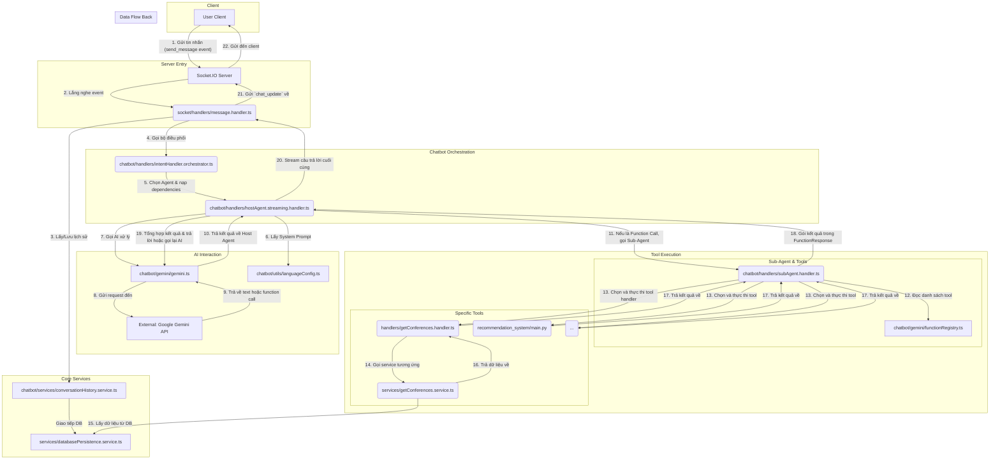

# Tổng quan các file Chức năng Chatbot

Tài liệu này mô tả chi tiết các file và thư mục liên quan đến chức năng chatbot trong dự án **Easyconf-Chatbot-Server**.

## 1. API và Điều hướng (API and Routing)

Nhóm này xử lý các yêu cầu HTTP ban đầu liên quan đến chatbot.

### `src/api/v1/chatbot/chat.routes.ts`
- **Mục đích**: Định nghĩa các API endpoint cho chức năng chatbot.
- **Chức năng chính**:
  - Đăng ký các route như `/v1/chatbot/send`, `/v1/chatbot/history`.
  - Áp dụng các middleware cần thiết cho việc xác thực và validate request.
  - Liên kết các route với `chat.controller.ts`.

### `src/api/v1/chatbot/chat.controller.ts`
- **Mục đích**: Xử lý logic cho các yêu cầu HTTP đến chatbot.
- **Chức năng chính**:
  - Nhận các yêu cầu từ client (ví dụ: gửi tin nhắn mới).
  - Gọi đến các service hoặc handler tương ứng để xử lý yêu cầu.
  - Trả về phản hồi HTTP cho client.

## 2. Giao tiếp Real-time (Socket Communication)

Nhóm này quản lý việc giao tiếp hai chiều, real-time giữa server và client, rất quan trọng cho trải nghiệm chatbot mượt mà.

### `src/socket/handlers/connection.handlers.ts`
- **Mục đích**: Quản lý các sự kiện kết nối và ngắt kết nối của client qua Socket.IO.
- **Chức năng chính**:
  - Xử lý khi một người dùng mới kết nối.
  - Dọn dẹp tài nguyên khi người dùng ngắt kết nối.

### `src/socket/handlers/conversation.handler.ts`
- **Mục đích**: Xử lý các sự kiện liên quan đến một phiên hội thoại hoàn chỉnh.
- **Chức năng chính**:
  - Bắt đầu một cuộc hội thoại mới.
  - Tải lịch sử hội thoại.
  - Kết thúc một cuộc hội thoại.

### `src/socket/handlers/message.handler.ts`
- **Mục đích**: Xử lý các tin nhắn được gửi đi và nhận về trong thời gian thực.
- **Chức năng chính**:
  - Nhận tin nhắn từ người dùng.
  - Gửi tin nhắn từ chatbot đến người dùng.
  - Xử lý các trạng thái của tin nhắn (đã gửi, đã nhận, đang gõ).

## 3. Logic xử lý chính (Core Chatbot Logic)

Đây là bộ não của chatbot, được chứa trong thư mục `src/chatbot/`.

### 3.1. Orchestrators (Bộ điều phối)

Các file này có vai trò điều phối, quyết định luồng hoạt động của chatbot.

- **`src/chatbot/handlers/intentHandler.orchestrator.ts`**:
  - **Mục đích**: "Bộ não" trung tâm, xác định ý định (intent) của người dùng.
  - **Chức năng chính**: Phân tích tin nhắn của người dùng và quyết định xem người dùng muốn làm gì (hỏi thông tin, chào hỏi, yêu cầu chức năng...), từ đó gọi đến các `handler` chuyên biệt khác.

- **`src/chatbot/handlers/hostAgent.streaming.handler.ts` / `hostAgent.nonStreaming.handler.ts`**:
  - **Mục đích**: Đóng vai trò là "Agent chính", quản lý các câu trả lời phức tạp hoặc cần nhiều bước.
  - **Chức năng chính**: Điều phối các `subAgent` để thu thập thông tin và tổng hợp lại câu trả lời cuối cùng. Nó cũng là nơi nạp `systemInstruction` từ `languageConfig.ts` để truyền vào `gemini.ts`. Có hai phiên bản: streaming (trả về từng phần) và non-streaming (trả về toàn bộ).

- **`src/chatbot/handlers/subAgent.handler.ts`**:
  - **Mục đích**: Đóng vai trò "Agent phụ", thực hiện các tác vụ cụ thể, nhỏ lẻ do `hostAgent` giao.
  - **Chức năng chính**: Thực hiện một nhiệm vụ duy nhất như tìm kiếm một loại dữ liệu cụ thể.

### 3.2. Capability Handlers & Services

Các `handler` trong `src/chatbot/handlers/` và các `service` tương ứng trong `src/chatbot/services/` chịu trách nhiệm thực thi các chức năng cụ thể mà chatbot có thể làm.

- **`.../handlers/getConferences.handler.ts` và `.../services/getConferences.service.ts`**:
  - **Mục đích**: Cung cấp chức năng tìm kiếm thông tin hội nghị.
  - **Chức năng chính**: Tương tác với cơ sở dữ liệu hoặc các service khác để truy vấn và trả về danh sách/thông tin các hội nghị theo yêu cầu của người dùng.

- **Các file khác**: `getWebsiteInfo`, `manageCalendar`, `manageFollow`, `manageBlacklist`, `sendEmailToAdmin`, `navigation`, `openGoogleMap` đều có các chức năng chuyên biệt tương ứng với tên gọi.

### 3.3. Dịch vụ lõi của Chatbot

- **`src/chatbot/services/conversationHistory.service.ts`**:
  - **Mục đích**: Quản lý lịch sử hội thoại.
  - **Chức năng chính**: Lưu và truy xuất các tin nhắn trong quá khứ để duy trì ngữ cảnh cho chatbot.

- **`src/chatbot/services/backendService.ts`**:
  - **Mục đích**: Cung cấp một lớp giao tiếp chung để các handler/service của chatbot có thể tương tác với phần còn lại của backend (ví dụ: database).

## 4. Tương tác AI (AI Interaction)

Nhóm này chịu trách nhiệm trực tiếp cho việc tương tác với mô hình ngôn ngữ lớn (Gemini) và quản lý cấu hình liên quan.

### 4.1. Nguồn kiến thức và Cấu hình Ngôn ngữ

- **`src/chatbot/language/instructions/*.ts`**:
  - **Mục đích**: Chứa các file TypeScript định nghĩa **prompt hệ thống (system prompt)** cho từng ngôn ngữ (ví dụ: `english.ts`, `vietnamese.ts`).
  - **Chức năng chính**: Các file này xuất ra các biến chuỗi (template string) chứa toàn bộ vai trò, ngữ cảnh, và kiến thức nền cho chatbot. Đây là nguồn kiến thức gốc thay vì file `instruction.txt`.

- **`src/chatbot/language/index.ts`**:
  - **Mục đích**: Tập hợp và xuất (export) tất cả các prompt hệ thống và khai báo hàm từ các file trong thư mục `instructions` và `functions`.
  - **Chức năng chính**: Đóng vai trò là một điểm truy cập duy nhất (`LangData`) cho `languageConfig.ts`.

- **`src/chatbot/utils/languageConfig.ts`**:
  - **Mục đích**: **File cực kỳ quan trọng**, chịu trách nhiệm nạp và xử lý các prompt hệ thống.
  - **Chức năng chính**: Dựa trên ngôn ngữ, ngữ cảnh, và thông tin cá nhân hóa của người dùng, file này sẽ chọn đúng template prompt từ `LangData`, thay thế các biến (như `[Today]`, `[User's First Name]`) và trả về `systemInstructions` hoàn chỉnh để `hostAgent` sử dụng.

### 4.2. Giao tiếp với API

- **`src/chatbot/gemini/gemini.ts`**:
  - **Mục đích**: Là cầu nối giao tiếp trực tiếp với Google Gemini API.
  - **Chức năng chính**: Nhận `systemInstruction` (đã được xử lý bởi `languageConfig.ts`), lịch sử hội thoại, và tin nhắn mới của người dùng để gửi đến Gemini. Nó không tự đọc file mà chỉ nhận nội dung prompt đã được chuẩn bị sẵn.

- **`src/chatbot/gemini/functionRegistry.ts`**:
  - **Mục đích**: Đăng ký các "hàm" mà mô hình AI có thể yêu cầu thực thi.
  - **Chức năng chính**: Tạo một danh sách các công cụ (tools) mà AI có thể sử dụng.

- **`src/chatbot/gemini/configLoader.ts`**:
  - **Mục đích**: Tải các cấu hình dành riêng cho việc gọi AI (ví dụ: `temperature`, `topK`).

## 5. Các tiện ích cốt lõi (Core Utilities)

Thư mục `src/chatbot/utils/` chứa các file hỗ trợ quan trọng cho luồng hoạt động của chatbot.

- **`src/chatbot/utils/confirmationManager.ts`**:
  - **Mục đích**: Quản lý việc xác nhận từ người dùng trước khi thực hiện các hành động quan trọng.
  - **Chức năng chính**: Xử lý các luồng hỏi-đáp như "Bạn có chắc muốn thực hiện hành động X không?" và chờ phản hồi từ người dùng.

- **`src/chatbot/utils/transformData.ts`**:
  - **Mục đích**: Chuyển đổi và định dạng dữ liệu.
  - **Chức năng chính**: Dùng để biến đổi cấu trúc dữ liệu nhận từ các service thành một định dạng phù hợp để hiển thị cho người dùng cuối.

- **`src/chatbot/utils/auth.ts`**:
  - **Mục đích**: Xử lý các logic liên quan đến xác thực người dùng trong ngữ cảnh chatbot.
  - **Chức năng chính**: Có thể chứa các hàm kiểm tra xem người dùng hiện tại có quyền thực hiện một chức năng cụ thể mà họ yêu cầu qua chat hay không.

## 6. Dịch vụ hỗ trợ & dùng chung (Supporting & Shared Services)

- **`src/services/chatbotAnalysis.service.ts`**:
  - **Mục đích**: Thực hiện các phân tích sâu hơn về cuộc hội thoại.
  - **Chức năng chính**: Có thể được dùng để phân tích cảm xúc, tóm tắt cuộc hội thoại, hoặc các tác vụ AI/ML khác.

- **`src/services/fileSystem.service.ts`**:
  - **Mục đích**: Cung cấp giao diện để tương tác với hệ thống file.
  - **Chức năng chính (đối với chatbot)**: Mặc dù không trực tiếp tải prompt, service này có thể được **các công cụ (tools)** của chatbot sử dụng. Ví dụ, một công cụ cho phép chatbot đọc/ghi file tạm để xử lý dữ liệu theo yêu cầu của người dùng.

- **`src/services/databasePersistence.service.ts`**:
  - **Mục đích**: Giao tiếp với cơ sở dữ liệu.
  - **Chức năng chính (đối với chatbot)**: Được `conversationHistory.service.ts` sử dụng để lưu/tải lịch sử chat, và được các service chức năng (`getConferences.service.ts`) dùng để truy vấn dữ liệu.

- **`src/services/logging.service.ts`**:
  - **Mục đích**: Ghi lại nhật ký hoạt động của ứng dụng.
  - **Chức năng chính (đối với chatbot)**: Ghi lại tin nhắn, lỗi, và các sự kiện quan trọng để gỡ lỗi và phân tích.

## 7. Cấu trúc dữ liệu (Data Structures)

- **`src/chatbot/interface/`, `src/chatbot/models/`, `src/chatbot/shared/types.ts`**:
  - **Mục đích**: Định nghĩa các `interface`, `model` (lớp), và `type` (kiểu dữ liệu) được sử dụng trong toàn bộ module chatbot.
- **`src/types/`**:
  - **Mục đích**: Chứa các định nghĩa kiểu dữ liệu chung cho toàn bộ ứng dụng.

## 8. Sơ đồ kiến trúc hệ thống Chatbot

### Chú thích luồng xử lý chi tiết

Sơ đồ trên mô tả luồng hoạt động của hệ thống chatbot, từ khi người dùng gửi tin nhắn cho đến khi nhận được phản hồi. Luồng xử lý được đánh số theo thứ tự thực thi:

1.  **Gửi tin nhắn**: Người dùng nhập và gửi một tin nhắn từ giao diện client.
2.  **Server nhận tin nhắn**: `Socket.IO Server` nhận sự kiện `send_message`.
3.  **Xử lý tin nhắn ban đầu**: `message.handler.ts` bắt sự kiện. Nó chịu trách nhiệm xác thực, sau đó sử dụng `conversationHistory.service.ts` để tải lịch sử chat hoặc tạo cuộc hội thoại mới. Dữ liệu lịch sử được lưu và lấy từ `databasePersistence.service.ts`.
4.  **Gọi bộ điều phối**: `message.handler.ts` chuyển tin nhắn của người dùng và lịch sử hội thoại cho `intentHandler.orchestrator.ts`.
5.  **Chọn Agent**: `intentHandler.orchestrator.ts` hoạt động như một "bộ não", quyết định `Agent` nào sẽ xử lý yêu cầu. Trong trường hợp này, nó khởi tạo và gọi `hostAgent.streaming.handler.ts` (Agent chính).
6.  **Chuẩn bị System Prompt**: `Host Agent` gọi `languageConfig.ts` để lấy `System Prompt` (hướng dẫn hệ thống) đã được cá nhân hóa dựa trên ngôn ngữ và thông tin người dùng.
7.  **Gọi AI (Gemini)**: `Host Agent` yêu cầu `gemini.ts` tạo ra câu trả lời.
8.  **Gửi Request đến Google**: `gemini.ts` đóng gói `System Prompt`, lịch sử chat, và tin nhắn mới để gửi đến `Google Gemini API`.
9.  **Nhận phản hồi từ AI**: Gemini API xử lý yêu cầu và trả về một trong hai dạng: một luồng văn bản (text stream) hoặc một yêu cầu thực thi hàm (`Function Call`).
10. **Xử lý kết quả AI**: `gemini.ts` trả kết quả này về cho `Host Agent`.
11. **Xử lý Function Call**: Nếu `Host Agent` nhận được một `Function Call` (ví dụ: yêu cầu tìm thông tin hội nghị), nó sẽ gọi `subAgent.handler.ts` để xử lý.
12. **Tra cứu Tool**: `Sub-Agent` tham chiếu đến `functionRegistry.ts` để xác định các tool/hàm hợp lệ.
13. **Thực thi Tool**: `Sub-Agent` tìm và thực thi `handler` tương ứng với tên `Function Call`. Ví dụ, nếu AI yêu cầu `getConferences`, `getConferences.handler.ts` sẽ được gọi. Các tool khác như hệ thống gợi ý (`recommendation_system`) cũng được kích hoạt ở bước này.
14. **Gọi Service**: `Handler` của tool (`getConferences.handler.ts`) gọi đến `service` tương ứng (`getConferences.service.ts`) để thực hiện logic nghiệp vụ.
15. **Truy vấn dữ liệu**: `Service` tương tác với `databasePersistence.service.ts` để lấy dữ liệu từ cơ sở dữ liệu.
16. **Trả dữ liệu về Handler**: Dữ liệu từ DB được trả về cho `Handler`.
17. **Trả kết quả về Sub-Agent**: `Handler` định dạng kết quả và trả về cho `Sub-Agent`.
18. **Gói kết quả cho Host Agent**: `Sub-Agent` đóng gói kết quả này vào một `FunctionResponse` và gửi lại cho `Host Agent`.
19. **Tổng hợp và tiếp tục vòng lặp**: `Host Agent` nhận `FunctionResponse`. Nó có thể quyết định gửi câu trả lời cuối cùng cho người dùng hoặc **quay lại bước 7**, gửi kết quả của hàm cho AI để nhận được một câu trả lời tự nhiên hơn dựa trên dữ liệu vừa lấy được.
20. **Stream câu trả lời cuối cùng**: Khi `Host Agent` có được câu trả lời cuối cùng dưới dạng văn bản, nó sẽ bắt đầu stream câu trả lời này về cho `message.handler.ts`.
21. **Gửi về Socket Server**: `message.handler.ts` phát sự kiện `chat_update` chứa các phần của câu trả lời.
22. **Hiển thị cho người dùng**: `Socket.IO Server` chuyển tiếp các cập nhật này đến Client, nơi chúng được hiển thị cho người dùng theo thời gian thực.
