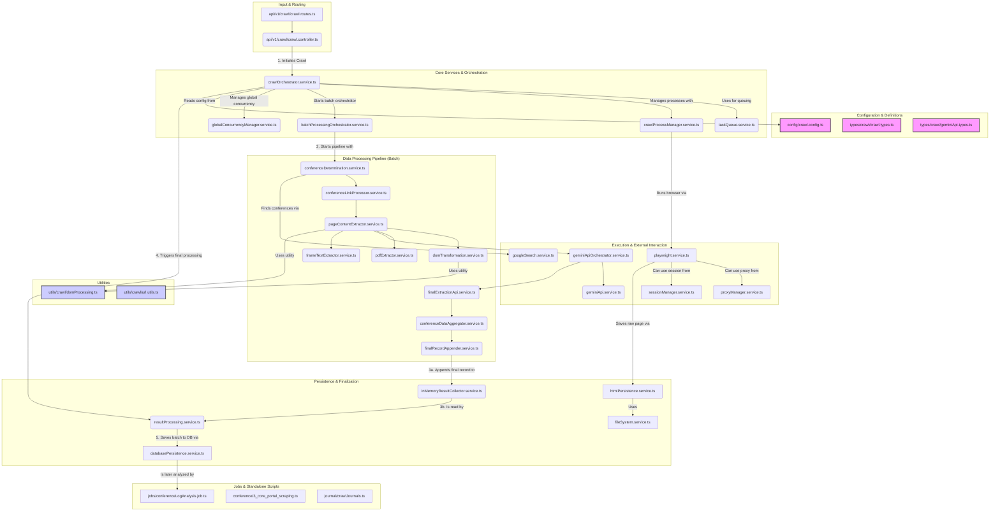

# Overview

Tài liệu này mô tả chi tiết các file liên quan đến chức năng crawl dữ liệu trong dự án Easyconf-Chatbot-Server.

## 1. API và Điều hướng

### `src/api/v1/crawl/crawl.controller.ts`

- **Mục đích**: Điều khiển các API endpoint cho chức năng crawl
- **Chức năng chính**:
  - Xử lý các yêu cầu HTTP liên quan đến crawl dữ liệu
  - Điều phối luồng xử lý giữa các dịch vụ
  - Xử lý lỗi và trả về phản hồi phù hợp

### `src/api/v1/crawl/crawl.routes.ts`

- **Mục đích**: Định nghĩa các route cho API crawl
- **Chức năng chính**:
  - Đăng ký các endpoint API
  - Áp dụng các middleware cần thiết (xác thực, validate, v.v.)
  - Kết nối các controller tương ứng

## 2. Dịch vụ Crawl Chính

### `src/services/crawlOrchestrator.service.ts`

- **Mục đích**: Điều phối chính quá trình crawl
- **Chức năng chính**:
  - Điều phối luồng công việc giữa các dịch vụ con
  - Quản lý trạng thái của quá trình crawl
  - Xử lý lỗi và khôi phục khi cần thiết
  - Quản lý vòng đời của các tác vụ crawl thông qua `TaskQueueService`
  - Thu thập kết quả thông qua `InMemoryResultCollectorService`
  - Xử lý kết quả cuối cùng thông qua `ResultProcessingService`

### `src/services/taskQueue.service.ts`

- **Mục đích**: Quản lý hàng đợi tác vụ cho mỗi request crawl
- **Chức năng chính**:
  - Kiểm soát số lượng tác vụ chạy đồng thời
  - Quản lý vòng đời của các tác vụ crawl
  - Cung cấp cơ chế chờ hoàn thành tất cả tác vụ
  - Đảm bảo tài nguyên hệ thống được sử dụng hiệu quả

### `src/services/inMemoryResultCollector.service.ts`

- **Mục đích**: Thu thập và lưu trữ kết quả crawl trong bộ nhớ
- **Chức năng chính**:
  - Lưu trữ tạm thời kết quả crawl
  - Cung cấp giao diện để thêm và truy xuất kết quả
  - Hỗ trợ xóa toàn bộ kết quả khi cần thiết
  - Làm việc song song với cơ chế lưu file

### `src/services/resultProcessing.service.ts`

- **Mục đích**: Xử lý và chuyển đổi kết quả crawl
- **Chức năng chính**:
  - Xử lý dữ liệu thô từ quá trình crawl
  - Chuyển đổi giữa các định dạng dữ liệu (JSONL, CSV)
  - Hỗ trợ cả xử lý trong bộ nhớ và qua file
  - Tích hợp với các dịch vụ khác để lưu trữ kết quả cuối cùng

### `src/services/crawlProcessManager.service.ts`

- **Mục đích**: Quản lý vòng đời của quá trình crawl
- **Chức năng chính**:
  - Khởi tạo và dừng các tiến trình crawl
  - Theo dõi trạng thái của các tiến trình đang chạy
  - Quản lý tài nguyên hệ thống

### `src/services/gemini/geminiApiOrchestrator.service.ts`

- **Mục đích**: Điều phối việc sử dụng Gemini API
- **Chức năng chính**:
  - Phân phối yêu cầu đến các instance Gemini API
  - Cân bằng tải giữa các API key
  - Xử lý rate limiting và retry

### `src/services/geminiApi.service.ts`

- **Mục đích**: Xử lý tương tác với Gemini API
- **Chức năng chính**:
  - Gửi request đến Gemini API
  - Xử lý response và lỗi
  - Cache kết quả khi cần thiết

-- Bắt đầu từ vị trí này, nội dung doc cho các file được viết hoàn toàn bằng AI mà không có sự can thiệp của con người --

### `src/services/playwright.service.ts`

- **Mục đích**: Thực hiện crawl dữ liệu từ web
- **Chức năng chính**:
  - Khởi tạo và quản lý trình duyệt Playwright
  - Thực hiện các thao tác trên trình duyệt
  - Xử lý JavaScript và các nội dung động

### `src/services/proxyManager.service.ts`

- **Mục đích**: Quản lý proxy cho việc crawl
- **Chức năng chính**:
  - Luân chuyển giữa các proxy
  - Kiểm tra tính khả dụng của proxy
  - Xử lý lỗi liên quan đến proxy

### `src/services/sessionManager.service.ts`

- **Mục đích**: Quản lý phiên làm việc khi crawl
- **Chức năng chính**:
  - Duy trì session giữa các lần request
  - Quản lý cookies và local storage
  - Xử lý đăng nhập nếu cần

## 3. Xử lý Dữ liệu

### `src/journal/crawlJournals.ts`

- **Mục đích**: Crawl dữ liệu từ các tạp chí khoa học
- **Chức năng chính**:
  - Thu thập thông tin từ các nguồn tạp chí
  - Xử lý và chuẩn hóa dữ liệu

### `src/services/batchProcessingOrchestrator.service.ts`

- **Mục đích**: Điều phối xử lý dữ liệu theo lô
- **Chức năng chính**:
  - Chia nhỏ dữ liệu thành các batch
  - Phân phối xử lý đồng thời
  - Tổng hợp kết quả

### `src/services/conferenceProcessor.service.ts`

- **Mục đích**: Xử lý dữ liệu hội nghị
- **Chức năng chính**:
  - Phân tích thông tin hội nghị
  - Trích xuất các trường dữ liệu quan trọng
  - Chuẩn hóa định dạng dữ liệu

-- here --

### `src/services/batchProcessing/conferenceDetermination.service.ts`

- **Mục đích**: Xác định website chính thức của hội nghị
- **Chức năng chính**:
  - Phân tích phản hồi API
  - Xác thực và chuẩn hóa URL
  - Tích hợp với Playwright để kiểm tra

### `src/services/batchProcessing/conferenceLinkProcessor.service.ts`

- **Mục đích**: Xử lý các liên kết liên quan đến hội nghị
- **Chức năng chính**:
  - Tìm và xác thực các liên kết quan trọng
  - Xử lý CFP và Important Dates
  - Kiểm tra tính hợp lệ của liên kết

### `src/services/batchProcessing/finalExtractionApi.service.ts`

- **Mục đích**: Trích xuất thông tin cuối cùng
- **Chức năng chính**:
  - Tổng hợp dữ liệu từ nhiều nguồn
  - Áp dụng các quy tắc xử lý cuối cùng
  - Chuẩn bị dữ liệu để lưu trữ

### `src/services/batchProcessing/pageContentExtractor.service.ts`

- **Mục đích**: Trích xuất nội dung trang web
- **Chức năng chính**:
  - Lấy nội dung văn bản từ HTML
  - Lọc bỏ các thành phần không cần thiết
  - Chuẩn hóa định dạng văn bản

### `src/services/batchProcessing/pdfExtractor.service.ts`

- **Mục đích**: Trích xuất nội dung từ file PDF
- **Chức năng chính**:
  - Đọc và phân tích file PDF
  - Trích xuất văn bản và siêu dữ liệu
  - Xử lý các trường hợp đặc biệt

### `src/services/batchProcessing/frameTextExtractor.service.ts`

- **Mục đích**: Trích xuất văn bản từ iframe
- **Chức năng chính**:
  - Phát hiện và xử lý các iframe
  - Đồng bộ hóa nội dung từ nhiều frame
  - Kết hợp kết quả từ các frame

### `src/services/batchProcessing/imageUrlExtractor.service.ts`

- **Mục đích**: Xử lý URL hình ảnh
- **Chức năng chính**:
  - Trích xuất và xác thực URL hình ảnh
  - Tối ưu hóa kích thước và định dạng
  - Lưu trữ hình ảnh

### `src/services/batchProcessing/domTransformation.service.ts`

- **Mục đích**: Biến đổi DOM
- **Chức năng chính**:
  - Áp dụng các phép biến đổi lên DOM
  - Lọc và làm sạch nội dung
  - Chuẩn hóa cấu trúc HTML

### `src/services/batchProcessing/conferenceDataAggregator.service.ts`

- **Mục đích**: Tổng hợp dữ liệu hội nghị
- **Chức năng chính**:
  - Kết hợp thông tin từ nhiều nguồn
  - Giải quyết xung đột dữ liệu
  - Tạo bản ghi thống nhất

### `src/services/batchProcessing/finalRecordAppender.service.ts`

- **Mục đích**: Ghi dữ liệu đã xử lý
- **Chức năng chính**:
  - Lưu trữ kết quả cuối cùng
  - Cập nhật cơ sở dữ liệu
  - Xử lý lỗi khi ghi dữ liệu

## 4. Công cụ Hỗ trợ

### `src/utils/crawl/domProcessing.ts`

- **Mục đích**: Cung cấp các hàm xử lý DOM chung
- **Chức năng chính**:
  - Lọc và làm sạch nội dung HTML
  - Trích xuất văn bản từ các phần tử cụ thể
  - Xử lý các trường hợp đặc biệt trong DOM

### `src/utils/crawl/url.utils.ts`

- **Mục đích**: Xử lý và chuẩn hóa URL
- **Chức năng chính**:
  - Kiểm tra tính hợp lệ của URL
  - Chuẩn hóa URL tuyệt đối/tương đối
  - Xử lý các tham số URL

### `src/utils/logAnalysisJournal/`

- **Mục đích**: Phân tích nhật ký tạp chí
- **Chức năng chính**:
  - Xử lý dữ liệu nhật ký từ các tạp chí
  - Trích xuất thông tin hữu ích
  - Tạo báo cáo phân tích

### `src/utils/logAnalysisConference/`

- **Mục đích**: Phân tích nhật ký hội nghị
- **Chức năng chính**:
  - Xử lý dữ liệu nhật ký từ các hội nghị
  - Phân tích hiệu suất crawl
  - Phát hiện vấn đề tiềm ẩn

## 5. Cấu hình và Kiểu dữ liệu

### `src/config/crawl.config.ts`

- **Mục đích**: Chứa cấu hình cho quá trình crawl
- **Chức năng chính**:
  - Định nghĩa các tham số mặc định
  - Cấu hình timeouts và retry
  - Thiết lập các giới hạn hệ thống

### `src/config/schemas.ts`

- **Mục đích**: Định nghĩa schema dữ liệu
- **Chức năng chính**:
  - Xác thực cấu trúc dữ liệu
  - Đảm bảo tính toàn vẹn dữ liệu
  - Tự động hóa kiểm tra kiểu

### `src/types/crawl/crawl.types.ts`

- **Mục đích**: Định nghĩa các kiểu dữ liệu cho module crawl
- **Chức năng chính**:
  - Định nghĩa interfaces và types
  - Tài liệu hóa cấu trúc dữ liệu
  - Hỗ trợ kiểm tra kiểu tĩnh

### `src/types/crawl/geminiApi.types.ts`

- **Mục đích**: Định nghĩa kiểu dữ liệu cho Gemini API
- **Chức năng chính**:
  - Mô tả cấu trúc request/response
  - Định nghĩa các tham số API
  - Tài liệu hóa cách sử dụng API

## 6. Tập lệnh và Dữ liệu

### `src/conference/3_core_portal_scraping.ts`

- **Mục đích**: Crawl dữ liệu từ các cổng thông tin hội nghị
- **Chức năng chính**:
  - Thu thập thông tin từ nhiều nguồn
  - Xử lý dữ liệu thô
  - Chuẩn bị dữ liệu cho quá trình xử lý tiếp theo

### `src/journal/scimagojr.ts`

- **Mục đích**: Lấy dữ liệu từ SCImago Journal Rank
- **Chức năng chính**:
  - Truy vấn cơ sở dữ liệu SCImago
  - Trích xuất thông tin tạp chí
  - Xử lý và lưu trữ kết quả

### `src/journal/googleSearch.ts`

- **Mục đích**: Tìm kiếm thông tin tạp chí qua Google
- **Chức năng chính**:
  - Thực hiện tìm kiếm có cấu trúc
  - Lọc và trích xuất kết quả
  - Xử lý các giới hạn của Google

### `src/conference/train/`

- **Mục đích**: Chứa dữ liệu và script huấn luyện
- **Chức năng chính**:
  - Lưu trữ tập dữ liệu mẫu
  - Chứa các script tiền xử lý
  - Hỗ trợ đánh giá mô hình

## 7. Tài liệu

### `docs/CrawlTechniques.txt`

- **Mục đích**: Tài liệu kỹ thuật crawl
- **Nội dung chính**:
  - Các kỹ thuật crawl tiên tiến
  - Cách xử lý các tình huống đặc biệt
  - Best practices và khuyến nghị

### `docs/extractInfo_analysis.md`

- **Mục đích**: Phân tích quá trình trích xuất thông tin
- **Nội dung chính**:
  - Các phương pháp trích xuất dữ liệu
  - Đánh giá hiệu quả
  - Cải tiến và tối ưu hóa

## 8. Các File Dữ liệu

### `src/journal/data/`

- **Mục đích**: Lưu trữ dữ liệu tạp chí
- **Nội dung chính**:
  - Dữ liệu thô từ các nguồn
  - Dữ liệu đã qua xử lý
  - Các file cấu hình liên quan

### `src/conference/evaluate/`

- **Mục đích**: Đánh giá kết quả crawl hội nghị
- **Chức năng chính**:
  - Chứa các script đánh giá
  - Lưu trữ kết quả đánh giá
  - Hỗ trợ phân tích hiệu suất

## 9. Xử lý Lỗi và Giám sát

### `src/services/logAnalysisCache.service.ts`

- **Mục đích**: Quản lý cache cho phân tích log
- **Chức năng chính**:
  - Lưu trữ tạm kết quả phân tích
  - Giảm tải cho hệ thống
  - Tăng tốc độ truy vấn

### `src/services/logDeletion.service.ts`

- **Mục đích**: Xử lý xóa log
- **Chức năng chính**:
  - Tự động dọn dẹp log cũ
  - Quản lý vòng đời log
  - Đảm bảo tuân thủ chính sách lưu trữ

### `src/services/logDownload.service.ts`

- **Mục đích**: Hỗ trợ tải log
  - Tạo file log để tải xuống
  - Nén và chuẩn bị dữ liệu
  - Xử lý yêu cầu tải xuống

## 10. Các Công cụ Hỗ trợ Khác

### `src/container.ts`

- **Mục đích**: Quản lý dependency injection
- **Chức năng chính**:
  - Đăng ký và khởi tạo các dịch vụ
  - Quản lý vòng đời của các đối tượng
  - Hỗ trợ kiểm thử và mock

### `src/config/app.config.ts`

- **Mục đích**: Cấu hình chung ứng dụng
- **Chức năng chính**:
  - Định nghĩa các biến môi trường
  - Cấu hình logging
  - Thiết lập các tham số hệ thống

### `src/config/gemini-api-type.config.ts`

- **Mục đích**: Cấu hình kiểu dữ liệu cho Gemini API
- **Chức năng chính**:
  - Định nghĩa các kiểu request/response
  - Xác thực dữ liệu đầu vào/ra
  - Tài liệu hóa API

### `src/services/requestState.service.ts`

- **Mục đích**: Theo dõi trạng thái request
- **Chức năng chính**:
  - Lưu trữ trạng thái hiện tại
  - Cung cấp cơ chế hủy bỏ request
  - Quản lý tài nguyên theo vòng đời request

### `src/services/inMemoryResultCollector.service.ts`

- **Mục đích**: Thu thập kết quả trong bộ nhớ
- **Chức năng chính**:
  - Lưu trữ tạm kết quả xử lý
  - Hỗ trợ truy vấn và lọc dữ liệu
  - Tối ưu hiệu năng truy cập

### `src/services/htmlPersistence.service.ts`

- **Mục đích**: Lưu trữ nội dung HTML
- **Chức năng chính**:
  - Lưu và truy xuất HTML
  - Nén và giải nén dữ liệu
  - Quản lý lưu trữ tạm

### `src/services/databasePersistence.service.ts`

- **Mục đích**: Tương tác với cơ sở dữ liệu
- **Chức năng chính**:
  - Thực thi các truy vấn
  - Quản lý kết nối
  - Xử lý transaction

### `src/services/fileSystem.service.ts`

- **Mục đích**: Thao tác với hệ thống file
- **Chức năng chính**:
  - Đọc/ghi file
  - Quản lý thư mục
  - Xử lý đường dẫn

### `src/services/gemini/geminiCachePersistence.service.ts`

- **Mục đích**: Quản lý cache cho Gemini API
- **Chức năng chính**:
  - Lưu trữ phản hồi API
  - Kiểm tra cache trước khi gọi API
  - Quản lý hết hạn cache

## 11. Xử lý Bất đồng bộ và Hàng đợi

### `src/services/taskQueue.service.ts`

- **Mục đích**: Quản lý hàng đợi công việc
- **Chức năng chính**:
  - Thêm và xử lý tác vụ bất đồng bộ
  - Giới hạn đồng thời
  - Xử lý lỗi và thử lại

### `src/services/globalConcurrencyManager.service.ts`

- **Mục đích**: Kiểm soát mức độ song song
- **Chức năng chính**:
  - Giới hạn số lượng tác vụ đồng thời
  - Cân bằng tải toàn cục
  - Tránh quá tải hệ thống

### `src/services/batchProcessing/utils.ts`

- **Mục đích**: Tiện ích xử lý theo lô
- **Chức năng chính**:
  - Chia nhỏ dữ liệu thành batch
  - Xử lý song song
  - Tổng hợp kết quả

## 12. Xử lý Lỗi và Khôi phục

### `src/services/errorHandler.service.ts`

- **Mục đích**: Xử lý lỗi tập trung
- **Chức năng chính**:
  - Bắt và phân loại lỗi
  - Ghi log lỗi
  - Thực hiện khôi phục khi có thể

### `src/services/retryManager.service.ts`

- **Mục đích**: Quản lý thử lại các thao tác thất bại
- **Chức năng chính**:
  - Áp dụng chính sách thử lại
  - Trì hoãn giữa các lần thử
  - Giới hạn số lần thử

## 13. Tối ưu hóa Hiệu suất

### `src/services/cacheManager.service.ts`

- **Mục đích**: Quản lý bộ nhớ đệm
- **Chức năng chính**:
  - Lưu trữ tạm kết quả
  - Quản lý hết hạn cache
  - Giảm tải cho các tác vụ nặng

### `src/services/performanceMonitor.service.ts`

- **Mục đích**: Giám sát hiệu suất
- **Chức năng chính**:
  - Đo lường thời gian thực thi
  - Phát hiện tắc nghẽn
  - Cung cấp thông số hiệu suất

## 14. Bảo mật và Xác thực

### `src/services/auth.service.ts`

- **Mục đích**: Xử lý xác thực
- **Chức năng chính**:
  - Xác thực người dùng
  - Quản lý phiên đăng nhập
  - Kiểm tra quyền truy cập

### `src/services/encryption.service.ts`

- **Mục đích**: Mã hóa dữ liệu
- **Chức năng chính**:
  - Mã hóa dữ liệu nhạy cảm
  - Giải mã khi cần thiết
  - Quản lý khóa bảo mật

## 15. Tích hợp Bên thứ ba

### `src/services/externalApi.service.ts`

- **Mục đích**: Tương tác với API bên ngoài
- **Chức năng chính**:
  - Gửi yêu cầu HTTP
  - Xử lý phản hồi
  - Xử lý lỗi và giới hạn tốc độ

## 16. Kiểm thử

### `src/tests/unit/`

- **Mục đích**: Kiểm thử đơn vị
- **Chức năng chính**:
  - Kiểm tra từng thành phần riêng lẻ
  - Đảm bảo tính chính xác
  - Phát hiện lỗi sớm

### `src/tests/integration/`

- **Mục đích**: Kiểm thử tích hợp
- **Chức năng chính**:
  - Kiểm tra tương tác giữa các thành phần
  - Phát hiện vấn đề về tương thích
  - Đảm bảo hoạt động đúng khi kết hợp

## 17. Tiện ích Hỗ trợ

### `src/utils/date.utils.ts`

- **Mục đích**: Xử lý ngày tháng
- **Chức năng chính**:
  - Định dạng ngày tháng
  - Tính toán khoảng thời gian
  - Chuyển đổi múi giờ

### `src/utils/string.utils.ts`

- **Mục đích**: Xử lý chuỗi
- **Chức năng chính**:
  - Cắt, nối chuỗi
  - Tìm kiếm và thay thế
  - Xử lý Unicode

## 18. Tài liệu và Ghi chú

### `docs/API.md`

- **Mục đích**: Tài liệu API
- **Nội dung chính**:
  - Mô tả các endpoint
  - Các tham số và phản hồi
  - Ví dụ sử dụng

## 19. Cấu hình Môi trường

### `.env.example`

- **Mục đích**: Mẫu cấu hình môi trường
- **Nội dung chính**:
  - Các biến môi trường cần thiết
  - Giá trị mặc định
  - Hướng dẫn cấu hình

## 20. Tích hợp CI/CD

### `.github/workflows/`

- **Mục đích**: Tự động hóa quy trình
- **Chức năng chính**:
  - Chạy kiểm thử tự động
  - Triển khai tự động
  - Kiểm tra chất lượng mã nguồn

## 21. Sơ đồ kiến trúc hệ thống

### Chú thích luồng xử lý chi tiết (Phiên bản đã điều chỉnh)

Sơ đồ trên mô tả một kiến trúc toàn diện của hệ thống crawl. Luồng hoạt động có thể được chia thành các giai đoạn chính sau:

**Giai đoạn 1: Khởi tạo và Điều phối**

1.  **API-Driven Initiation**: Luồng xử lý bắt đầu tại `crawl.routes.ts`, nơi định nghĩa endpoint API. Khi có request, `crawl.controller.ts` tiếp nhận và gọi `crawlOrchestrator.service.ts` để khởi tạo một phiên crawl.
2.  **Core Orchestration**: `crawlOrchestrator.service.ts` là bộ não của hệ thống, chịu trách nhiệm:
    *   Sử dụng `taskQueue.service.ts` và `globalConcurrencyManager.service.ts` để quản lý hàng đợi và số lượng tác vụ chạy song song.
    *   Dùng `crawlProcessManager.service.ts` để tạo và quản lý các tiến trình con (worker), mỗi tiến trình chạy một instance của trình duyệt headless `playwright.service.ts`.
    *   Kích hoạt `batchProcessingOrchestrator.service.ts` để bắt đầu chuỗi xử lý dữ liệu chính.
    *   Đọc các cấu hình từ `crawl.config.ts`.

**Giai đoạn 2: Thực thi và Xử lý dữ liệu (Pipeline)**

Đây là chuỗi các bước xử lý dữ liệu được điều phối bởi `batchProcessingOrchestrator.service.ts`, lặp lại cho mỗi mục trong hàng đợi:

*   **Tìm kiếm và Xác định (Determination)**: `conferenceDetermination.service.ts` sử dụng `googleSearch.service.ts` để tìm kiếm và xác định trang web chính thức của hội nghị.
*   **Trích xuất Nội dung thô (Content Extraction)**: `conferenceLinkProcessor.service.ts` và `pageContentExtractor.service.ts` làm việc cùng nhau để duyệt trang, tìm các liên kết quan trọng, và trích xuất nội dung text từ HTML (sử dụng `domTransformation.service.ts`), PDF (`pdfExtractor.service.ts`), hoặc `iframe` (`frameTextExtractor.service.ts`).
*   **Phân tích bằng AI (AI Analysis)**: Nội dung text thô được đưa đến `geminiApiOrchestrator.service.ts` để phân tích và nhận dạng thông tin bằng mô hình ngôn ngữ lớn.
*   **Trích xuất và Tổng hợp (Final Extraction & Aggregation)**: `finalExtractionApi.service.ts` trích xuất dữ liệu có cấu trúc từ kết quả của AI, và `conferenceDataAggregator.service.ts` tổng hợp các mảnh dữ liệu lại thành một bản ghi hội nghị thống nhất.

**Giai đoạn 3: Thu thập, Hoàn tất và Lưu trữ**

3.  **Thu thập kết quả (Result Collection)**:
    *   **(3a)** `finalRecordAppender.service.ts` nhận bản ghi đã được tổng hợp hoàn chỉnh và **ghi nó vào kho chứa tạm** `inMemoryResultCollector.service.ts`. Quá trình này lặp lại cho mỗi hội nghị được xử lý.
4.  **Xử lý cuối cùng (Final Processing)**:
    *   **(4)** Sau khi tất cả các task trong hàng đợi đã chạy xong, `crawlOrchestrator.service.ts` sẽ kích hoạt `resultProcessing.service.ts` để bắt đầu giai đoạn cuối.
    *   **(3b)** `resultProcessing.service.ts` **đọc toàn bộ dữ liệu** đã được thu thập từ `inMemoryResultCollector.service.ts`.
5.  **Lưu trữ vĩnh viễn (Persistence)**:
    *   **(5)** `resultProcessing.service.ts` thực hiện các chuyển đổi cuối cùng (nếu cần) và gọi `databasePersistence.service.ts` để **lưu toàn bộ lô dữ liệu** xuống cơ sở dữ liệu.

**Các thành phần khác:**

*   **Utilities**: Các file trong `utils/` cung cấp các hàm tiện ích tái sử dụng.
*   **Configuration & Definitions**: Các file trong `config/` và `types/` định nghĩa cấu trúc dữ liệu và các tham số cấu hình.
*   **Jobs & Standalone Scripts**: Các tác vụ chạy nền hoặc độc lập như `conferenceLogAnalysis.job.ts` để phân tích dữ liệu đã có trong CSDL.
